# AcmeCorp Platform


## Overview

AcmeCorp Platform is a local-first demo platform for JVM microservices plus a React SPA. The repository includes Spring Boot and Quarkus services, a Vite webapp, and Docker Compose wiring for local development. The Docker Compose configuration in `infra/local/docker-compose.yml` is the source of truth for local runtime behavior, while `webapp/` provides a UI that targets the gateway. Terraform and Helm assets exist for infrastructure and Kubernetes workflows but are separate from the local compose setup.

## Repository Structure

- `services/` — Spring Boot and Quarkus service sources
- `webapp/` — React + Vite single-page app
- `infra/` — local Docker Compose, Kubernetes manifests, and Terraform
- `helm/` — Helm charts and deployment docs
- `charts/` — packaged/umbrella chart assets
- `scripts/` — automation scripts (smoke tests, Terraform wrapper)
- `integration-tests/` — integration test suite
- `docs/` — guides and reference documentation
- `bench/` — benchmarking harness

## Local Development (Docker Compose)

### Prerequisites

- Docker and Docker Compose v2
- Node.js >= 20 (for `webapp/`)
- Java + Maven (for running JVM tests locally)

### Start/stop the stack

```bash
cd infra/local
docker compose up -d --build
```

```bash
cd infra/local
docker compose down --volumes
```

### Access points

- Gateway API: `http://localhost:8080/api/gateway/status`
- Orders: `http://localhost:8081`
- Billing: `http://localhost:8082`
- Notification: `http://localhost:8083`
- Analytics: `http://localhost:8084`
- Catalog: `http://localhost:8085`
- Postgres: `localhost:5432`
- Redis: `localhost:6379`
- RabbitMQ: `localhost:5672` (UI: `http://localhost:15672`)
- Webapp (dev server): `http://localhost:5173`

To run the web UI:

```bash
cd webapp
npm install
npm run dev
```

The webapp defaults to `VITE_API_BASE_URL=http://localhost:8080`.

### Logs

```bash
cd infra/local
docker compose logs -f
```

## Architecture



Source: `docs/architecture/docker-compose.mmd`

## Documentation

Detailed documentation, architecture diagrams, and system explanations can be found in  
[`docs/README.md`](docs/README.md).

## Infrastructure (Terraform)

Use `scripts/tf.sh` as the entry point. It wraps Terraform in `infra/terraform/` and sets AWS defaults.

```bash
./scripts/tf.sh init
./scripts/tf.sh plan
./scripts/tf.sh apply
```

AWS SSO is required for the `tf` profile. The script runs `aws sso login` during `init`, but you can also run it explicitly:

```bash
aws sso login --profile tf
```

Recommended environment variables:

```bash
export AWS_PROFILE=tf
export AWS_SDK_LOAD_CONFIG=1
export AWS_REGION=eu-west-1
```

If Terraform is missing, install it first (see `scripts/tf.sh` for guidance).

## Testing

Backend unit tests:

```bash
make test-backend
```

Frontend unit tests:

```bash
make test-frontend
```

Integration tests (requires the local stack running):

```bash
make up
make test-integration
make down
```

Run all tests:

```bash
make test-all
```

More detail: [`docs/testing.md`](docs/testing.md)

## Troubleshooting

- `terraform: command not found` — install Terraform and rerun `./scripts/tf.sh` (see `scripts/tf.sh`).
- AWS SSO expired token — run `aws sso login --profile tf` and retry.
