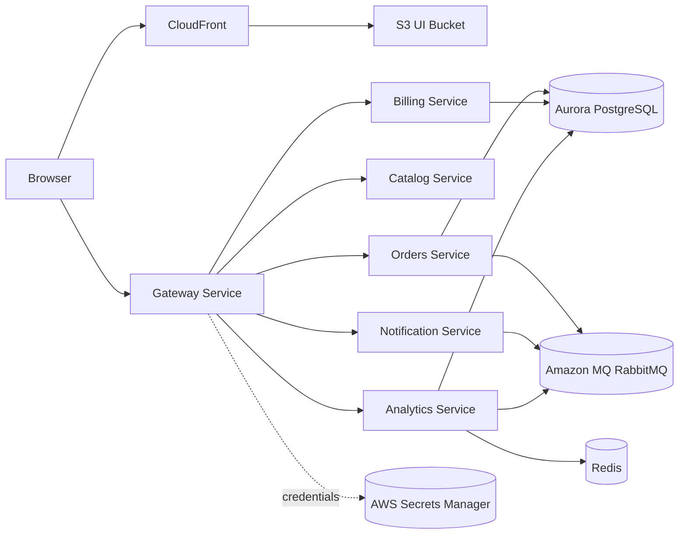

# System Overview

AcmeCorp Platform is a multi-service application with a static UI, a gateway entry point, multiple backend services, and AWS-managed infrastructure.

## Deployment Topology

## Request Flow

### Deployed Flow

1. Browser loads the SPA from `https://app.acmecorp.autoscaling.io`
2. CloudFront serves static assets from the private S3 bucket
3. The built UI calls `https://api.acmecorp.autoscaling.io`
4. `gateway-service` routes requests to backend services
5. Backend services use Aurora, Redis, RabbitMQ, and Secrets Manager-backed credentials

### Local Flow

1. Vite runs at `http://localhost:5173`
2. The UI reads `VITE_API_BASE_URL=http://localhost:8080`
3. The browser calls the local gateway directly
4. The gateway CORS policy allows the local UI origin

## Major Components

### UI

- Location: `webapp/`
- Stack: React 18 + Vite 5 + TypeScript
- API configuration: `VITE_API_BASE_URL`
- Deploy target: S3 + CloudFront

### Gateway

- Location: `services/spring-boot/gateway-service`
- Stack: Spring Boot WebFlux
- Public API prefix: `/api/gateway/**`
- Responsibilities:
  - single browser-facing API surface
  - backend aggregation and proxying
  - CORS enforcement for local and deployed UI origins

### Backend Services

- `orders-service`
- `billing-service`
- `notification-service`
- `analytics-service`
- `catalog-service` (Quarkus)

See [../reference/services.md](../reference/services.md) for ports, health endpoints, and metrics endpoints.

### Infrastructure

- **VPC**: networking and subnets
- **EKS**: workload platform
- **Aurora**: relational data store
- **Amazon MQ**: RabbitMQ-compatible broker
- **Redis**: analytics cache / counters
- **Secrets Manager**: credential source of truth
- **Route53 + ACM**: public DNS and certificates
- **S3 + CloudFront**: UI hosting

### Observability

- Prometheus scrapes service metrics
- Grafana renders dashboards
- Spring services expose `/actuator/prometheus`
- Quarkus exposes `/q/metrics`
- No explicit OpenTelemetry pipeline is currently implemented in this repository

## Kubernetes Structure

Primary namespaces:
- `acmecorp`: application workloads
- `data`: Redis and data-adjacent workloads
- `observability`: Prometheus and Grafana
- `external-secrets`: External Secrets operator

The canonical Kubernetes packaging is the Helm umbrella chart at `helm/acmecorp-platform`.
