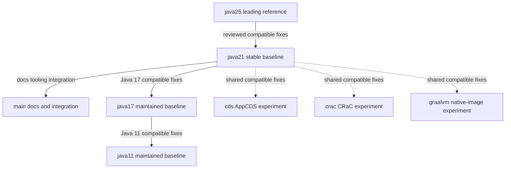

# Branch Model

## Purpose

This document is the canonical description of the repository branch model.

Use it to understand:
- what each long-lived branch is for
- which branches are maintained platform baselines versus experiments
- how fixes are adapted across branches
- which branch properties must remain stable
- how benchmark results should be interpreted across branches

This repository does not use blind branch parity as its operating model. The long-lived branches intentionally preserve different Java baselines, framework baselines, runtime assumptions, and experiment semantics.

## Branch Categories

The repository uses three branch categories:
- maintained platform branches: `java25`, `java21`, `java17`, `java11`
- integration and content branch: `main`
- experiment branches: `cds`, `crac`, `graalvm`

Core rules:
- No blind merges between long-lived branches.
- `java25` is the leading technical reference branch, but changes still have to be adapted deliberately before they move downward.
- `main` is the front door for documentation, course material, and shared tooling, not a guarantee of exact parity with `java21`.
- Experiment branches are separate lines of work, not cumulative optimization layers by default.

## Maintained Platform Branches

### java25

`java25` is the newest-generation technical reference branch.

It is the leading branch for:
- modern Java runtime and framework exploration
- newer technical baselines
- forward-looking compatibility work

It is not automatically a performance win. Benchmark results involving `java25` must be described as platform-branch results unless the harness explicitly isolates only the JVM.

Preserve on `java25`:
- Java 25 compiler and runtime baseline
- Java 25-compatible framework baselines
- Docker base images and CI assumptions aligned to Java 25

### java21

`java21` is the clean Java 21 technical baseline.

It is the stable comparison branch for:
- current production-like baseline work
- Java 21-compatible fixes
- benchmark comparisons where a stable Java 21 baseline matters

`java21` receives fixes from `java25` only when they are explicitly reviewed and adapted for Java 21 compatibility.

Preserve on `java21`:
- Java 21 compiler and runtime baseline
- Java 21 framework baselines
- Java 21-compatible Docker and CI assumptions

### main

`main` is the Java21-based integration, content, and tooling branch.

It is the front door for:
- repository navigation
- canonical documentation
- course material and episode assets
- shared tooling and integration-oriented work

`main` is not necessarily identical to `java21`. It may contain additional documentation, course assets, and shared tooling that do not belong on the clean Java 21 baseline branch.

Preserve on `main`:
- Java 21-based integration assumptions where runtime behavior is documented
- canonical docs and navigation
- content and tooling that support the repository as a whole

### java17

`java17` is the maintained older Java 17 baseline.

It receives:
- Java 17-compatible fixes from `java21`
- selected shared fixes that remain valid on Java 17

It must not take on Java 21+ runtime or API assumptions.

Preserve on `java17`:
- Java 17 compiler and runtime baseline
- Java 17-compatible framework baselines
- Docker and CI assumptions aligned to Java 17
- absence of Java 21+ runtime behavior leaking into the branch

### java11

`java11` is the maintained older Java 11 baseline.

It receives:
- Java 11-compatible fixes from `java17`
- selected shared fixes that remain valid on Java 11

It must not take on Java 17+ or Java 21+ runtime or API assumptions.

Preserve on `java11`:
- Java 11 compiler and runtime baseline
- Java 11-compatible framework baselines
- Docker and CI assumptions aligned to Java 11
- absence of newer runtime features leaking into the branch

## Experiment Branches

### cds

`cds` is the AppCDS and startup-optimization experiment branch.

It preserves AppCDS-specific behavior such as:
- AppCDS-oriented Dockerfiles
- startup flags
- class-list and archive generation
- AppCDS-specific scripts
- AppCDS-specific documentation

It should not blindly receive runtime changes that alter AppCDS semantics.

### crac

`crac` is the CRaC and checkpoint-restore experiment branch.

It preserves CRaC-specific behavior such as:
- CRaC checkpoint and restore lifecycle
- CRaC-specific Dockerfiles
- Azul CRaC runtime usage
- CRaC hooks and scripts
- CRaC-specific documentation

It should not receive AppCDS or GraalVM behavior by default.

AppCDS and CRaC remain separate unless a dedicated combined experiment branch is created explicitly.

### graalvm

`graalvm` is the GraalVM and native-image experiment branch.

It preserves native-image-specific behavior such as:
- native-image Maven profiles
- GraalVM-oriented Dockerfiles
- reflection and resource configuration
- experiment-specific scripts
- CI behavior needed for native-image validation
- GraalVM-specific documentation

New DTOs, entities, repositories, and similar runtime-facing additions may require native-image validation before they are safe on this branch.

## Sync Direction

The repository sync model is deliberate and downward-adapted, not merge-driven.

Working rules:
- `java25 -> java21`: port reviewed Java-compatible fixes deliberately.
- `java21 -> java17`: port only fixes that remain valid on Java 17.
- `java17 -> java11`: port only fixes that remain valid on Java 11.
- `main`: receives docs, content, shared tooling, and Java21-based integration work as appropriate.
- experiment branches: receive only compatible shared fixes that preserve experiment semantics.

### Preservation Rules

When adapting work across branches, preserve each target branch baseline:
- Java version
- compiler target
- Docker base images
- CI Java version
- framework baselines
- experiment-specific runtime behavior

Additional preservation rules:
- Virtual thread behavior must not leak into `java17` or `java11`.
- AppCDS, CRaC, and GraalVM are separate experiment branches, not cumulative optimization layers by default.
- AppCDS and CRaC should remain separate unless a dedicated combined experiment is created explicitly.

### Benchmark Interpretation

Benchmark wording must follow the actual scope of the branch model:
- describe maintained-branch benchmark results as platform branch comparisons unless the harness explicitly isolates only the JVM
- do not describe Java 25 results as a universal JVM performance result
- do not treat `java25` as an automatic runtime upgrade win
- distinguish maintained platform branch benchmarks from narrower experiment or JVM-isolation work

Practical implication:
- `java25` versus `java21` usually means Java version, framework baseline, packaging, and runtime assumptions may all differ
- experiment branch results should be described as experiment-specific unless the benchmark scope proves otherwise
