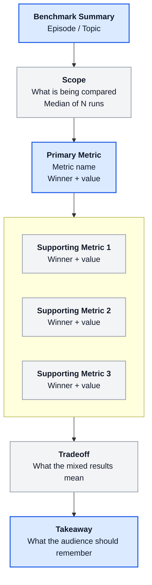
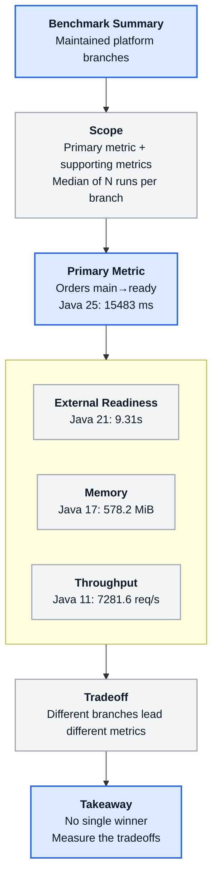
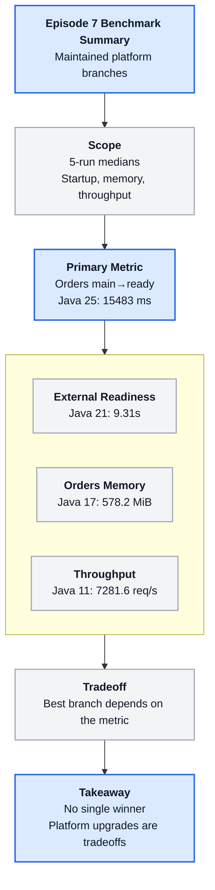

# Benchmark Summary Slide

Use this asset when an episode needs to summarize measured benchmark results on a single presentation slide.

The goal is not to show every number. The goal is to help the viewer understand:
- the primary metric
- the supporting metrics
- the tradeoff pattern
- the practical takeaway

This file is a reusable template. Adapt the labels and values per episode.

## Slide structure

Recommended slide order:

1. Title
2. Primary metric
3. Supporting metrics
4. Tradeoff summary
5. Takeaway

Recommended speaking order:

1. State the main metric first.
2. Name which option wins that metric.
3. Add the supporting metrics only after the audience understands the main result.
4. End with the tradeoff, not with a forced winner.

## Presenter notes

- Use one primary metric only.
- Keep supporting metrics to 2-3.
- If the benchmark is not JVM-only, say so explicitly.
- If there is no single winner, use the takeaway node to say that directly.
- Do not overload the slide with methodology detail. Keep source and method short.

## Reusable Mermaid template

```md

```

## Reusable benchmark-branch variant

Use this version when the slide needs named branch or runtime winners instead of generic options.

```md

```

## Optional Episode 7 example

This example is included to show how the template can be instantiated. Reuse the structure, not the wording.

```md

```

## How to adapt this asset

For each new episode:
- replace the title
- choose one primary metric
- keep the supporting metrics short
- rewrite the takeaway in plain spoken language
- only include source/method wording if it changes interpretation

If the episode has:
- one clear winner: keep the tradeoff node short and make the takeaway operational
- mixed results: make the tradeoff node explicit and avoid ranking language
- too many metrics: split into two slides instead of adding more nodes
