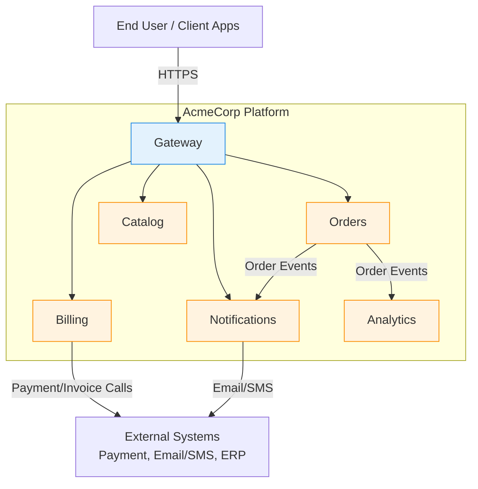

```mermaid
graph TD
  U[End User / Client Apps]
  EXT[External Systems <br> Payment, Email/SMS, ERP]

  subgraph AcmeCorp Platform
    GW[Gateway]
    ORD[Orders]
    CAT[Catalog]
    BIL[Billing]
    NOTIF[Notifications]
    ANA[Analytics]
  end

  U -->|HTTPS| GW
  GW --> ORD
  GW --> CAT
  GW --> BIL
  GW --> NOTIF

  ORD -->|Order Events| NOTIF
  ORD -->|Order Events| ANA

  BIL -->|Payment/Invoice Calls| EXT
  NOTIF -->|Email/SMS| EXT

  classDef edge fill:#e3f2fd,stroke:#1e88e5
  classDef svc fill:#fff3e0,stroke:#fb8c00
  class GW edge
  class ORD,CAT,BIL,NOTIF,ANA svc
```
