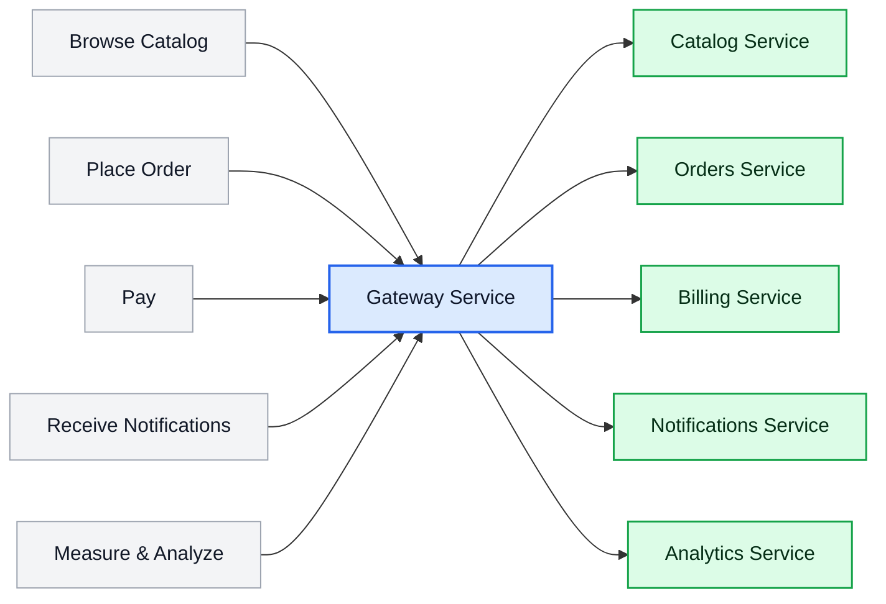

```mermaid
flowchart LR

%% === AcmeCorp Diagram Style Standard ===
classDef client fill:#F3F4F6,stroke:#9CA3AF,stroke-width:1px,color:#111827;
classDef gateway fill:#DBEAFE,stroke:#2563EB,stroke-width:2px,color:#0F172A;
classDef service fill:#DCFCE7,stroke:#16A34A,stroke-width:1.5px,color:#052E16;

%% === Domain capabilities (left) ===
Browse[Browse Catalog]:::client
Buy[Place Order]:::client
Pay[Pay]:::client
Notify[Receive Notifications]:::client
Measure[Measure & Analyze]:::client

%% === Implementation as services (right) ===
Gateway[Gateway Service]:::gateway
Catalog[Catalog Service]:::service
Orders[Orders Service]:::service
Billing[Billing Service]:::service
Notifications[Notifications Service]:::service
Analytics[Analytics Service]:::service

%% === Mapping ===
Browse --> Gateway --> Catalog
Buy --> Gateway --> Orders
Pay --> Gateway --> Billing
Notify --> Gateway --> Notifications
Measure --> Gateway --> Analytics
```
