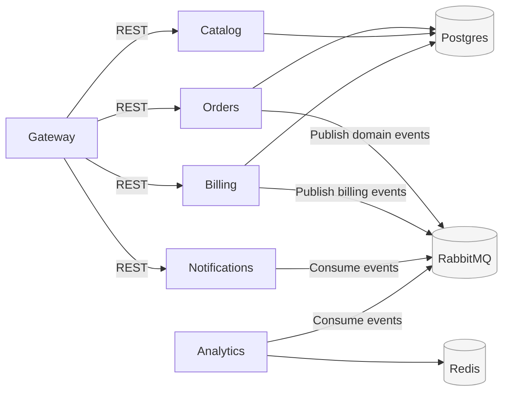

```mermaid
graph LR
  GW[Gateway]
  ORD[Orders]
  CAT[Catalog]
  BIL[Billing]
  NOTIF[Notifications]
  ANA[Analytics]

  PG[(Postgres)]
  RMQ[(RabbitMQ)]
  RED[(Redis)]

  GW -->|REST| ORD
  GW -->|REST| CAT
  GW -->|REST| BIL
  GW -->|REST| NOTIF

  ORD --> PG
  CAT --> PG
  BIL --> PG

  ORD -->|Publish domain events| RMQ
  BIL -->|Publish billing events| RMQ
  NOTIF -->|Consume events| RMQ
  ANA -->|Consume events| RMQ

  ANA --> RED

  classDef infra fill:#f5f5f5,stroke:#999
  class PG,RMQ,RED infra
```
