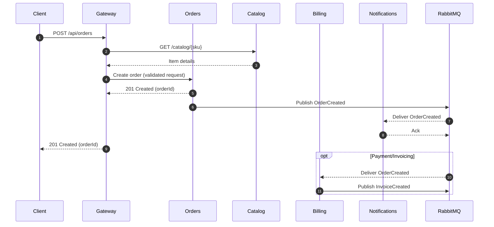

```mermaid
sequenceDiagram
  autonumber
  participant C as Client
  participant G as Gateway
  participant O as Orders
  participant Ca as Catalog
  participant B as Billing
  participant N as Notifications
  participant Q as RabbitMQ

  C->>G: POST /api/orders
  G->>Ca: GET /catalog/{sku}
  Ca-->>G: Item details
  G->>O: Create order (validated request)
  O-->>G: 201 Created (orderId)
  O->>Q: Publish OrderCreated
  Q-->>N: Deliver OrderCreated
  N-->>Q: Ack
  G-->>C: 201 Created (orderId)

  opt Payment/Invoicing
    Q-->>B: Deliver OrderCreated
    B->>Q: Publish InvoiceCreated
  end
```
