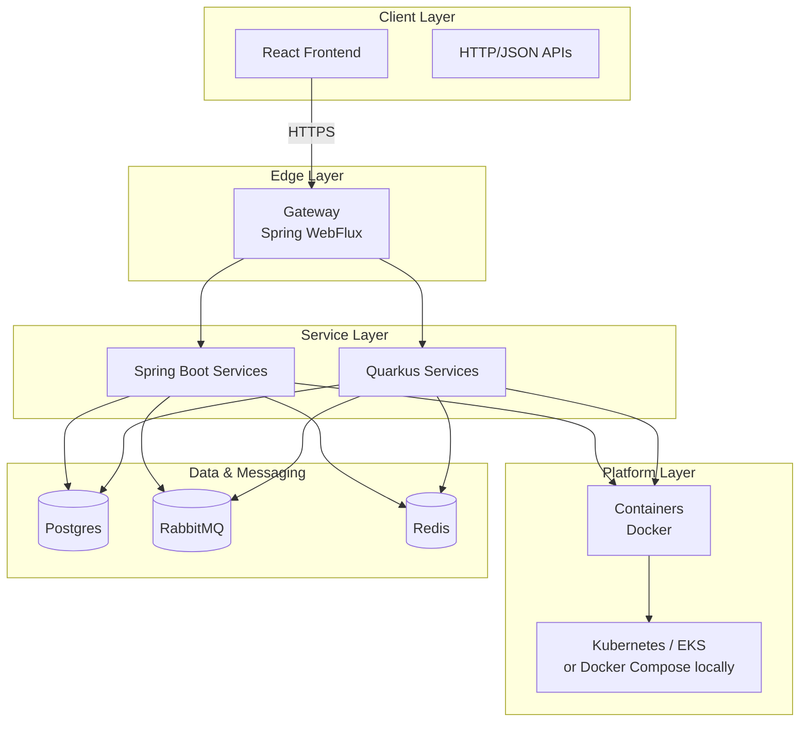

```mermaid
graph TB
  subgraph Client Layer
    WEB[React Frontend]
    API[HTTP/JSON APIs]
  end

  subgraph Edge Layer
    GW[Gateway
Spring WebFlux]
  end

  subgraph Service Layer
    SB[Spring Boot Services]
    QK[Quarkus Services]
  end

  subgraph Platform Layer
    CTR[Containers
Docker]
    ORCH[Kubernetes / EKS
or Docker Compose locally]
  end

  subgraph Data & Messaging
    PG[(Postgres)]
    RMQ[(RabbitMQ)]
    RED[(Redis)]
  end

  WEB -->|HTTPS| GW
  GW --> SB
  GW --> QK
  SB --> PG
  QK --> PG
  SB --> RMQ
  QK --> RMQ
  SB --> RED
  QK --> RED

  SB --> CTR
  QK --> CTR
  CTR --> ORCH
```
