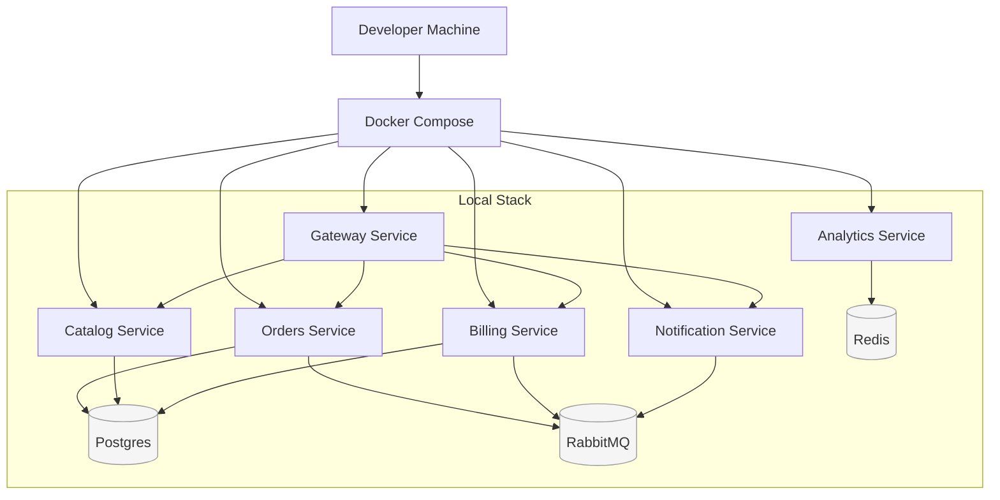

```mermaid
graph TD
  DEV[Developer Machine]
  DC[Docker Compose]

  DEV --> DC

  subgraph Local Stack
    GW[Gateway Service]
    ORD[Orders Service]
    CAT[Catalog Service]
    BIL[Billing Service]
    NOTIF[Notification Service]
    ANA[Analytics Service]

    PG[(Postgres)]
    RMQ[(RabbitMQ)]
    RED[(Redis)]
  end

  DC --> GW
  DC --> ORD
  DC --> CAT
  DC --> BIL
  DC --> NOTIF
  DC --> ANA

  ORD --> PG
  CAT --> PG
  BIL --> PG

  ORD --> RMQ
  BIL --> RMQ
  NOTIF --> RMQ

  ANA --> RED

  GW --> ORD
  GW --> CAT
  GW --> BIL
  GW --> NOTIF

  classDef infra fill:#f5f5f5,stroke:#999
  class PG,RMQ,RED infra
```
