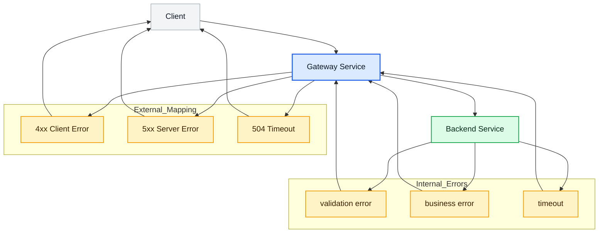

```mermaid
flowchart TB

classDef gateway fill:#DBEAFE,stroke:#2563EB,stroke-width:2px,color:#0F172A;
classDef service fill:#DCFCE7,stroke:#16A34A,stroke-width:1.5px,color:#052E16;
classDef client fill:#F3F4F6,stroke:#9CA3AF,stroke-width:1px,color:#111827;
classDef infra fill:#FEF3C7,stroke:#F59E0B,stroke-width:1.5px,color:#3B1F00;

Client[Client]:::client
Gateway[Gateway Service]:::gateway
Service[Backend Service]:::service

subgraph Internal_Errors
direction LR
EVal[validation error]:::infra
EBiz[business error]:::infra
ETo[timeout]:::infra
end

subgraph External_Mapping
direction LR
E4xx[4xx Client Error]:::infra
E5xx[5xx Server Error]:::infra
E504[504 Timeout]:::infra
end

Client --> Gateway --> Service

Service --> EVal --> Gateway
Service --> EBiz --> Gateway
Service --> ETo --> Gateway

Gateway --> E4xx --> Client
Gateway --> E5xx --> Client
Gateway --> E504 --> Client

```