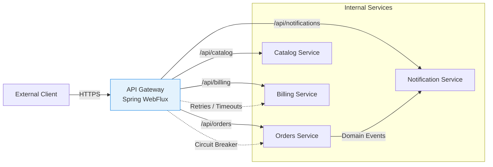

```mermaid
graph LR
  CLIENT[External Client]
  GW[API Gateway <br> Spring WebFlux]

  CLIENT -->|HTTPS| GW

  subgraph Internal Services
    ORD[Orders Service]
    CAT[Catalog Service]
    BIL[Billing Service]
    NOTIF[Notification Service]
  end

  GW -->|/api/orders| ORD
  GW -->|/api/catalog| CAT
  GW -->|/api/billing| BIL
  GW -->|/api/notifications| NOTIF

  GW -.->|Circuit Breaker| ORD
  GW -.->|Retries / Timeouts| BIL

  ORD -->|Domain Events| NOTIF

  classDef gateway fill:#e3f2fd,stroke:#1e88e5
  class GW gateway
```