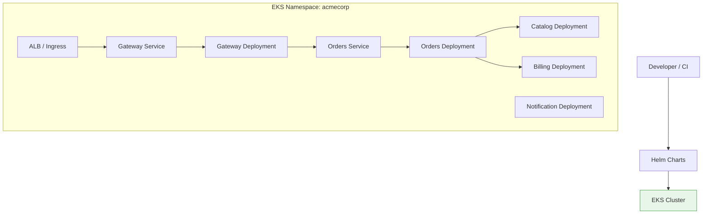

```mermaid
graph TD
  DEV[Developer / CI]
  HELM[Helm Charts]
  K8S[EKS Cluster]

  DEV --> HELM
  HELM --> K8S

  subgraph EKS Namespace: acmecorp
    GW[Gateway Deployment]
    ORD[Orders Deployment]
    CAT[Catalog Deployment]
    BIL[Billing Deployment]
    NOTIF[Notification Deployment]

    SVC_GW[Gateway Service]
    SVC_ORD[Orders Service]

    ALB[ALB / Ingress]
  end

  ALB --> SVC_GW
  SVC_GW --> GW

  GW --> SVC_ORD
  SVC_ORD --> ORD

  ORD --> CAT
  ORD --> BIL

  classDef k8s fill:#e8f5e9,stroke:#43a047
  class K8S k8s
```
