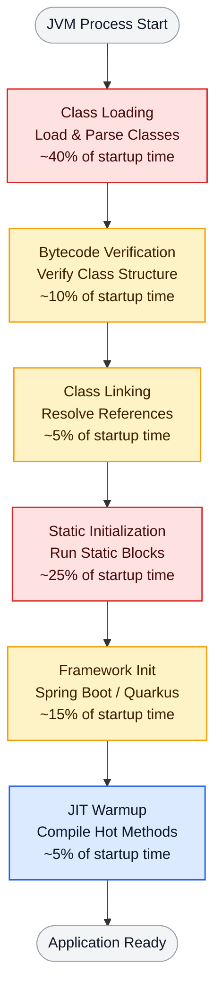

```mermaid
flowchart TB

%% === AcmeCorp Diagram Style Standard ===
classDef phase fill:#DCFCE7,stroke:#16A34A,stroke-width:1.5px,color:#052E16;
classDef critical fill:#FEE2E2,stroke:#DC2626,stroke-width:1.5px,color:#450A0A;
classDef moderate fill:#FEF3C7,stroke:#F59E0B,stroke-width:1.5px,color:#3B1F00;
classDef light fill:#DBEAFE,stroke:#2563EB,stroke-width:1.5px,color:#0F172A;
classDef endpoint fill:#F3F4F6,stroke:#9CA3AF,stroke-width:1px,color:#111827;

%% === Nodes ===
Start([JVM Process Start]):::endpoint
ClassLoad[Class Loading<br/>Load & Parse Classes<br/>~40% of startup time]:::critical
Verify[Bytecode Verification<br/>Verify Class Structure<br/>~10% of startup time]:::moderate
Link[Class Linking<br/>Resolve References<br/>~5% of startup time]:::moderate
Init[Static Initialization<br/>Run Static Blocks<br/>~25% of startup time]:::critical
Framework[Framework Init<br/>Spring Boot / Quarkus<br/>~15% of startup time]:::moderate
JIT[JIT Warmup<br/>Compile Hot Methods<br/>~5% of startup time]:::light
Ready([Application Ready]):::endpoint

%% === Flow ===
Start --> ClassLoad
ClassLoad --> Verify
Verify --> Link
Link --> Init
Init --> Framework
Framework --> JIT
JIT --> Ready
```
