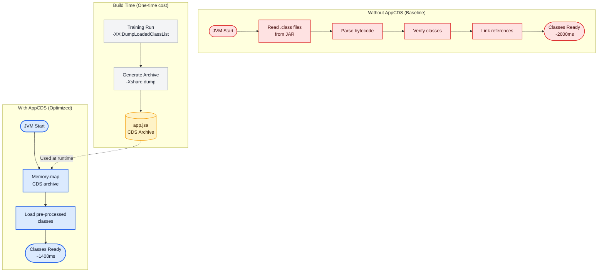

```mermaid
flowchart TB

%% === AcmeCorp Diagram Style Standard ===
classDef baseline fill:#FEE2E2,stroke:#DC2626,stroke-width:1.5px,color:#450A0A;
classDef optimized fill:#DBEAFE,stroke:#2563EB,stroke-width:2px,color:#0F172A;
classDef buildtime fill:#F3F4F6,stroke:#9CA3AF,stroke-width:1px,color:#111827;
classDef artifact fill:#FEF3C7,stroke:#F59E0B,stroke-width:1.5px,color:#3B1F00;
classDef endpoint fill:#DCFCE7,stroke:#16A34A,stroke-width:1.5px,color:#052E16;

subgraph Without["Without AppCDS (Baseline)"]
    Start1([JVM Start]):::baseline
    Read1[Read .class files<br/>from JAR]:::baseline
    Parse1[Parse bytecode]:::baseline
    Verify1[Verify classes]:::baseline
    Link1[Link references]:::baseline
    Ready1([Classes Ready<br/>~2000ms]):::baseline
    
    Start1 --> Read1
    Read1 --> Parse1
    Parse1 --> Verify1
    Verify1 --> Link1
    Link1 --> Ready1
end

subgraph With["With AppCDS (Optimized)"]
    Start2([JVM Start]):::optimized
    Map[Memory-map<br/>CDS archive]:::optimized
    Load2[Load pre-processed<br/>classes]:::optimized
    Ready2([Classes Ready<br/>~1400ms]):::optimized
    
    Start2 --> Map
    Map --> Load2
    Load2 --> Ready2
end

subgraph Build["Build Time (One-time cost)"]
    Train[Training Run<br/>-XX:DumpLoadedClassList]:::buildtime
    Generate[Generate Archive<br/>-Xshare:dump]:::buildtime
    Archive[(app.jsa<br/>CDS Archive)]:::artifact
    
    Train --> Generate
    Generate --> Archive
end

Archive -.->|Used at runtime| Map
```
