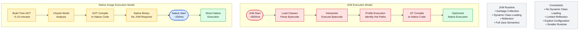

```mermaid
flowchart TB

%% === AcmeCorp Diagram Style Standard ===
classDef jvm fill:#FEE2E2,stroke:#DC2626,stroke-width:1.5px,color:#450A0A;
classDef native fill:#DBEAFE,stroke:#2563EB,stroke-width:2px,color:#0F172A;
classDef buildtime fill:#FEF3C7,stroke:#F59E0B,stroke-width:1.5px,color:#3B1F00;
classDef runtime fill:#DCFCE7,stroke:#16A34A,stroke-width:1.5px,color:#052E16;
classDef note fill:#F3F4F6,stroke:#9CA3AF,stroke-width:1px,color:#111827;

subgraph JVM["JVM Execution Model"]
    JVMStart([JVM Start<br/>~3000ms]):::jvm
    LoadClasses[Load Classes<br/>Parse Bytecode]:::jvm
    Interpret[Interpreter<br/>Execute Bytecode]:::jvm
    Profile[Profile Execution<br/>Identify Hot Paths]:::jvm
    JITCompile[JIT Compile<br/>to Native Code]:::jvm
    Optimized[Optimized<br/>Native Execution]:::runtime
    
    JVMStart --> LoadClasses
    LoadClasses --> Interpret
    Interpret --> Profile
    Profile --> JITCompile
    JITCompile --> Optimized
end

subgraph Native["Native Image Execution Model"]
    BuildTime[Build Time AOT<br/>~5-10 minutes]:::buildtime
    Analyze[Closed-World<br/>Analysis]:::buildtime
    Compile[AOT Compile<br/>to Native Code]:::buildtime
    Binary[Native Binary<br/>No JVM Required]:::buildtime
    NativeStart([Native Start<br/>~200ms]):::native
    DirectExec[Direct Native<br/>Execution]:::runtime
    
    BuildTime --> Analyze
    Analyze --> Compile
    Compile --> Binary
    Binary --> NativeStart
    NativeStart --> DirectExec
end

JVMRuntime[JVM Runtime<br/>• Garbage Collection<br/>• Dynamic Class Loading<br/>• Reflection<br/>• Full Java Semantics]:::note
Constraints[Constraints<br/>• No Dynamic Class Loading<br/>• Limited Reflection<br/>• Explicit Configuration<br/>• Smaller Runtime]:::note
```
