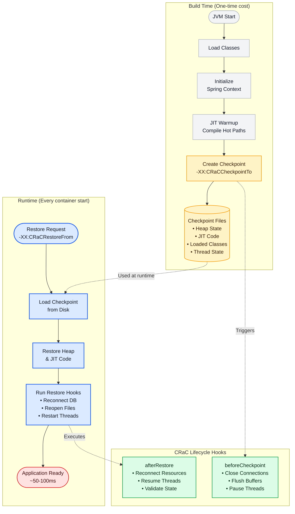

```mermaid
flowchart TB

%% === AcmeCorp Diagram Style Standard ===
classDef buildtime fill:#F3F4F6,stroke:#9CA3AF,stroke-width:1px,color:#111827;
classDef checkpoint fill:#FEF3C7,stroke:#F59E0B,stroke-width:1.5px,color:#3B1F00;
classDef runtime fill:#DBEAFE,stroke:#2563EB,stroke-width:2px,color:#0F172A;
classDef hooks fill:#DCFCE7,stroke:#16A34A,stroke-width:1.5px,color:#052E16;
classDef endpoint fill:#FEE2E2,stroke:#DC2626,stroke-width:1.5px,color:#450A0A;

subgraph BuildTime["Build Time (One-time cost)"]
    Start([JVM Start]):::buildtime
    LoadC[Load Classes]:::buildtime
    InitC[Initialize<br/>Spring Context]:::buildtime
    WarmupC[JIT Warmup<br/>Compile Hot Paths]:::buildtime
    Checkpoint[Create Checkpoint<br/>-XX:CRaCCheckpointTo]:::checkpoint
    Snapshot[(Checkpoint Files<br/>• Heap State<br/>• JIT Code<br/>• Loaded Classes<br/>• Thread State)]:::checkpoint
    
    Start --> LoadC
    LoadC --> InitC
    InitC --> WarmupC
    WarmupC --> Checkpoint
    Checkpoint --> Snapshot
end

subgraph Runtime["Runtime (Every container start)"]
    Restore([Restore Request<br/>-XX:CRaCRestoreFrom]):::runtime
    LoadSnapshot[Load Checkpoint<br/>from Disk]:::runtime
    RestoreHeap[Restore Heap<br/>& JIT Code]:::runtime
    Hooks[Run Restore Hooks<br/>• Reconnect DB<br/>• Reopen Files<br/>• Restart Threads]:::runtime
    Ready([Application Ready<br/>~50-100ms]):::endpoint
    
    Restore --> LoadSnapshot
    LoadSnapshot --> RestoreHeap
    RestoreHeap --> Hooks
    Hooks --> Ready
end

subgraph Lifecycle["CRaC Lifecycle Hooks"]
    BeforeCheckpoint[beforeCheckpoint<br/>• Close Connections<br/>• Flush Buffers<br/>• Pause Threads]:::hooks
    AfterRestore[afterRestore<br/>• Reconnect Resources<br/>• Resume Threads<br/>• Validate State]:::hooks
end

Snapshot -.->|Used at runtime| LoadSnapshot
Checkpoint -.->|Triggers| BeforeCheckpoint
Hooks -.->|Executes| AfterRestore
```
