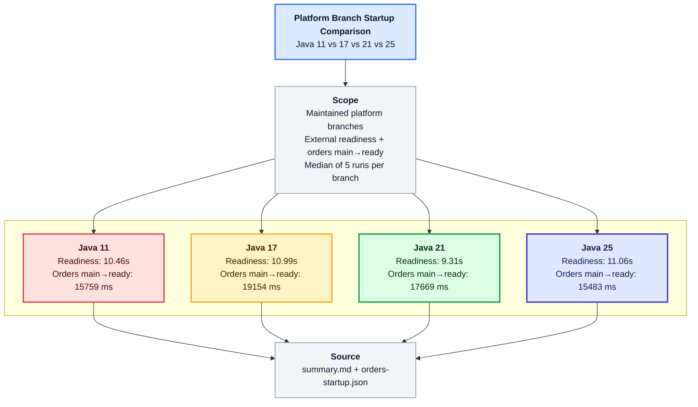

```mermaid
flowchart TB

%% === AcmeCorp Diagram Style Standard ===
classDef java11 fill:#FEE2E2,stroke:#DC2626,stroke-width:2px,color:#450A0A;
classDef java17 fill:#FEF3C7,stroke:#F59E0B,stroke-width:2px,color:#3B1F00;
classDef java21 fill:#DCFCE7,stroke:#16A34A,stroke-width:2.5px,color:#052E16;
classDef java25 fill:#E0E7FF,stroke:#4338CA,stroke-width:2.5px,color:#1E1B4B;
classDef metric fill:#DBEAFE,stroke:#2563EB,stroke-width:2px,color:#0F172A;
classDef neutral fill:#F3F4F6,stroke:#9CA3AF,stroke-width:1.5px,color:#111827;

Title["<b>Platform Branch Startup Comparison</b><br/>Java 11 vs 17 vs 21 vs 25"]:::metric
Scope["<b>Scope</b><br/>Maintained platform branches<br/>External readiness + orders main→ready<br/>Median of 5 runs per branch"]:::neutral

subgraph Compare[" "]
direction LR
J11["<b>Java 11</b><br/>Readiness: 10.46s<br/>Orders main→ready: 15759 ms"]:::java11
J17["<b>Java 17</b><br/>Readiness: 10.99s<br/>Orders main→ready: 19154 ms"]:::java17
J21["<b>Java 21</b><br/>Readiness: 9.31s<br/>Orders main→ready: 17669 ms"]:::java21
J25["<b>Java 25</b><br/>Readiness: 11.06s<br/>Orders main→ready: 15483 ms"]:::java25
end

Source["<b>Source</b><br/>summary.md + orders-startup.json"]:::neutral

Title --> Scope
Scope --> J11
Scope --> J17
Scope --> J21
Scope --> J25
J11 --> Source
J17 --> Source
J21 --> Source
J25 --> Source
```
