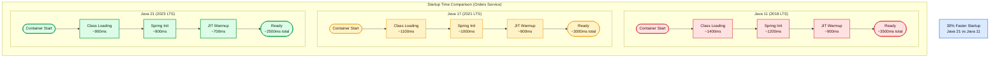

```mermaid
flowchart TB

%% === AcmeCorp Diagram Style Standard ===
classDef java11 fill:#FEE2E2,stroke:#DC2626,stroke-width:1.5px,color:#450A0A;
classDef java17 fill:#FEF3C7,stroke:#F59E0B,stroke-width:1.5px,color:#3B1F00;
classDef java21 fill:#DCFCE7,stroke:#16A34A,stroke-width:2px,color:#052E16;
classDef metric fill:#DBEAFE,stroke:#2563EB,stroke-width:1.5px,color:#0F172A;
classDef label fill:#F3F4F6,stroke:#9CA3AF,stroke-width:1px,color:#111827;

subgraph Comparison["Startup Time Comparison (Orders Service)"]
    direction TB
    
    subgraph Java11["Java 11 (2018 LTS)"]
        J11Start([Container Start]):::java11
        J11Load[Class Loading<br/>~1400ms]:::java11
        J11Init[Spring Init<br/>~1200ms]:::java11
        J11Warmup[JIT Warmup<br/>~900ms]:::java11
        J11Ready([Ready<br/>~3500ms total]):::java11
        
        J11Start --> J11Load
        J11Load --> J11Init
        J11Init --> J11Warmup
        J11Warmup --> J11Ready
    end
    
    subgraph Java17["Java 17 (2021 LTS)"]
        J17Start([Container Start]):::java17
        J17Load[Class Loading<br/>~1100ms]:::java17
        J17Init[Spring Init<br/>~1000ms]:::java17
        J17Warmup[JIT Warmup<br/>~900ms]:::java17
        J17Ready([Ready<br/>~3000ms total]):::java17
        
        J17Start --> J17Load
        J17Load --> J17Init
        J17Init --> J17Warmup
        J17Warmup --> J17Ready
    end
    
    subgraph Java21["Java 21 (2023 LTS)"]
        J21Start([Container Start]):::java21
        J21Load[Class Loading<br/>~900ms]:::java21
        J21Init[Spring Init<br/>~900ms]:::java21
        J21Warmup[JIT Warmup<br/>~700ms]:::java21
        J21Ready([Ready<br/>~2500ms total]):::java21
        
        J21Start --> J21Load
        J21Load --> J21Init
        J21Init --> J21Warmup
        J21Warmup --> J21Ready
    end
end

Improvement[30% Faster Startup<br/>Java 21 vs Java 11]:::metric
```
