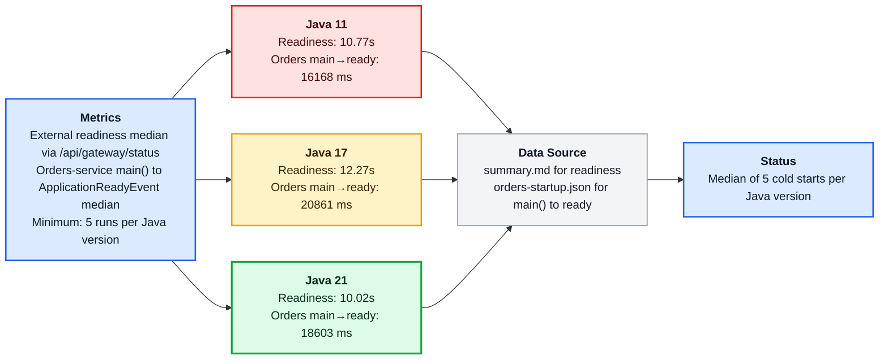

```mermaid
flowchart LR

%% === AcmeCorp Diagram Style Standard ===
classDef java11 fill:#FEE2E2,stroke:#DC2626,stroke-width:2px,color:#450A0A;
classDef java17 fill:#FEF3C7,stroke:#F59E0B,stroke-width:2px,color:#3B1F00;
classDef java21 fill:#DCFCE7,stroke:#16A34A,stroke-width:2.5px,color:#052E16;
classDef metric fill:#DBEAFE,stroke:#2563EB,stroke-width:2px,color:#0F172A;
classDef neutral fill:#F3F4F6,stroke:#9CA3AF,stroke-width:1.5px,color:#111827;

Method["<b>Metrics</b><br/>External readiness median via /api/gateway/status<br/>Orders-service main() to ApplicationReadyEvent median<br/>Minimum: 5 runs per Java version"]:::metric

J11["<b>Java 11</b><br/>Readiness: 10.77s<br/>Orders main→ready: 16168 ms"]:::java11
J17["<b>Java 17</b><br/>Readiness: 12.27s<br/>Orders main→ready: 20861 ms"]:::java17
J21["<b>Java 21</b><br/>Readiness: 10.02s<br/>Orders main→ready: 18603 ms"]:::java21

Data["<b>Data Source</b><br/>summary.md for readiness<br/>orders-startup.json for main() to ready"]:::neutral
Result["<b>Status</b><br/>Median of 5 cold starts per Java version"]:::metric

Method --> J11
Method --> J17
Method --> J21
J11 --> Data
J17 --> Data
J21 --> Data
Data --> Result
```
