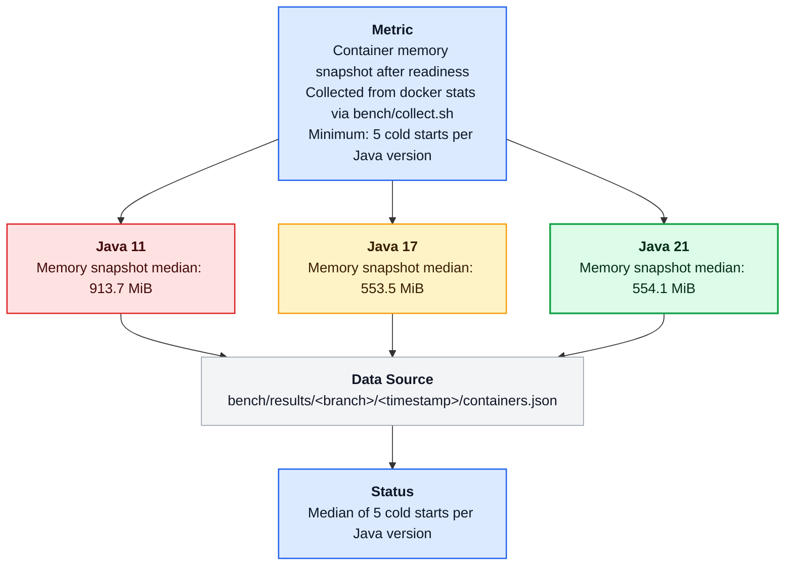

```mermaid
flowchart TB

%% === AcmeCorp Diagram Style Standard ===
classDef java11 fill:#FEE2E2,stroke:#DC2626,stroke-width:1.5px,color:#450A0A;
classDef java17 fill:#FEF3C7,stroke:#F59E0B,stroke-width:1.5px,color:#3B1F00;
classDef java21 fill:#DCFCE7,stroke:#16A34A,stroke-width:2px,color:#052E16;
classDef metric fill:#DBEAFE,stroke:#2563EB,stroke-width:1.5px,color:#0F172A;
classDef component fill:#F3F4F6,stroke:#9CA3AF,stroke-width:1px,color:#111827;

Method["<b>Metric</b><br/>Container memory snapshot after readiness<br/>Collected from docker stats via bench/collect.sh<br/>Minimum: 5 cold starts per Java version"]:::metric

J11["<b>Java 11</b><br/>Memory snapshot median: 913.7 MiB"]:::java11
J17["<b>Java 17</b><br/>Memory snapshot median: 553.5 MiB"]:::java17
J21["<b>Java 21</b><br/>Memory snapshot median: 554.1 MiB"]:::java21

Data["<b>Data Source</b><br/>bench/results/&lt;branch&gt;/&lt;timestamp&gt;/containers.json"]:::component
Status["<b>Status</b><br/>Median of 5 cold starts per Java version"]:::metric

Method --> J11
Method --> J17
Method --> J21
J11 --> Data
J17 --> Data
J21 --> Data
Data --> Status
```
