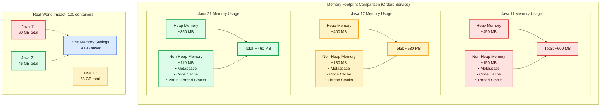

```mermaid
flowchart TB

%% === AcmeCorp Diagram Style Standard ===
classDef java11 fill:#FEE2E2,stroke:#DC2626,stroke-width:1.5px,color:#450A0A;
classDef java17 fill:#FEF3C7,stroke:#F59E0B,stroke-width:1.5px,color:#3B1F00;
classDef java21 fill:#DCFCE7,stroke:#16A34A,stroke-width:2px,color:#052E16;
classDef metric fill:#DBEAFE,stroke:#2563EB,stroke-width:1.5px,color:#0F172A;
classDef component fill:#F3F4F6,stroke:#9CA3AF,stroke-width:1px,color:#111827;

subgraph Comparison["Memory Footprint Comparison (Orders Service)"]
    direction TB
    
    subgraph Java11["Java 11 Memory Usage"]
        J11Heap[Heap Memory<br/>~450 MB]:::java11
        J11NonHeap[Non-Heap Memory<br/>~150 MB<br/>• Metaspace<br/>• Code Cache<br/>• Thread Stacks]:::java11
        J11Total[Total: ~600 MB]:::java11
        
        J11Heap --> J11Total
        J11NonHeap --> J11Total
    end
    
    subgraph Java17["Java 17 Memory Usage"]
        J17Heap[Heap Memory<br/>~400 MB]:::java17
        J17NonHeap[Non-Heap Memory<br/>~130 MB<br/>• Metaspace<br/>• Code Cache<br/>• Thread Stacks]:::java17
        J17Total[Total: ~530 MB]:::java17
        
        J17Heap --> J17Total
        J17NonHeap --> J17Total
    end
    
    subgraph Java21["Java 21 Memory Usage"]
        J21Heap[Heap Memory<br/>~350 MB]:::java21
        J21NonHeap[Non-Heap Memory<br/>~110 MB<br/>• Metaspace<br/>• Code Cache<br/>• Virtual Thread Stacks]:::java21
        J21Total[Total: ~460 MB]:::java21
        
        J21Heap --> J21Total
        J21NonHeap --> J21Total
    end
end

subgraph Impact["Real-World Impact (100 containers)"]
    I11[Java 11<br/>60 GB total]:::java11
    I17[Java 17<br/>53 GB total]:::java17
    I21[Java 21<br/>46 GB total]:::java21
    Savings[23% Memory Savings<br/>14 GB saved]:::metric
    
    I11 -.-> Savings
    I21 -.-> Savings
end
```
