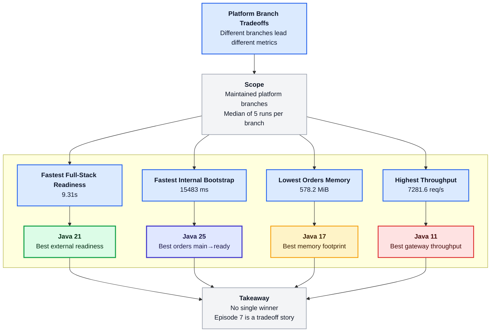

```mermaid
flowchart TB

%% === AcmeCorp Diagram Style Standard ===
classDef java11 fill:#FEE2E2,stroke:#DC2626,stroke-width:2px,color:#450A0A;
classDef java17 fill:#FEF3C7,stroke:#F59E0B,stroke-width:2px,color:#3B1F00;
classDef java21 fill:#DCFCE7,stroke:#16A34A,stroke-width:2.5px,color:#052E16;
classDef java25 fill:#E0E7FF,stroke:#4338CA,stroke-width:2.5px,color:#1E1B4B;
classDef metric fill:#DBEAFE,stroke:#2563EB,stroke-width:2px,color:#0F172A;
classDef neutral fill:#F3F4F6,stroke:#9CA3AF,stroke-width:1.5px,color:#111827;

Title["<b>Platform Branch Tradeoffs</b><br/>Different branches lead different metrics"]:::metric
Scope["<b>Scope</b><br/>Maintained platform branches<br/>Median of 5 runs per branch"]:::neutral

subgraph Tradeoffs[" "]
direction LR
M1["<b>Fastest Full-Stack Readiness</b><br/>9.31s"]:::metric
J21["<b>Java 21</b><br/>Best external readiness"]:::java21

M2["<b>Fastest Internal Bootstrap</b><br/>15483 ms"]:::metric
J25["<b>Java 25</b><br/>Best orders main→ready"]:::java25

M3["<b>Lowest Orders Memory</b><br/>578.2 MiB"]:::metric
J17["<b>Java 17</b><br/>Best memory footprint"]:::java17

M4["<b>Highest Throughput</b><br/>7281.6 req/s"]:::metric
J11["<b>Java 11</b><br/>Best gateway throughput"]:::java11
end

Takeaway["<b>Takeaway</b><br/>No single winner<br/>Episode 7 is a tradeoff story"]:::neutral

Title --> Scope
Scope --> M1 --> J21
Scope --> M2 --> J25
Scope --> M3 --> J17
Scope --> M4 --> J11
J21 --> Takeaway
J25 --> Takeaway
J17 --> Takeaway
J11 --> Takeaway
```
