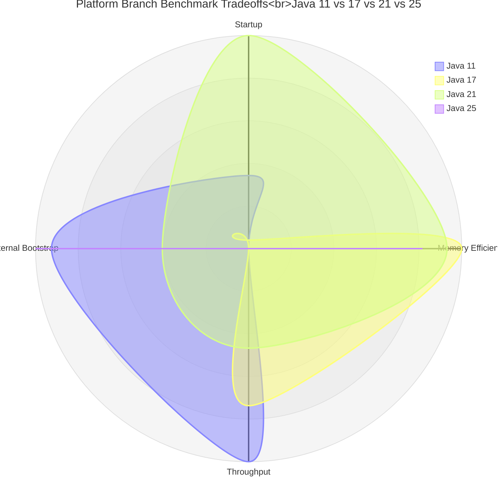

```mermaid
radar-beta
title Platform Branch Benchmark Tradeoffs<br/>Java 11 vs 17 vs 21 vs 25

axis startup["Startup"]
axis memory["Memory Efficiency"]
axis throughput["Throughput"]
axis bootstrap["Internal Bootstrap"]

%% Relative strength scores normalized from the 5-run medians.
%% Higher is better on every axis.
%% Startup + Internal Bootstrap invert lower-is-better timings.
%% Memory Efficiency inverts lower-is-better memory footprint.

curve java11["Java 11"]{34.3, 0.0, 100.0, 92.5}
curve java17["Java 17"]{4.0, 100.0, 73.7, 0.0}
curve java21["Java 21"]{100.0, 93.1, 46.7, 40.5}
curve java25["Java 25"]{0.0, 81.6, 0.0, 100.0}
```
