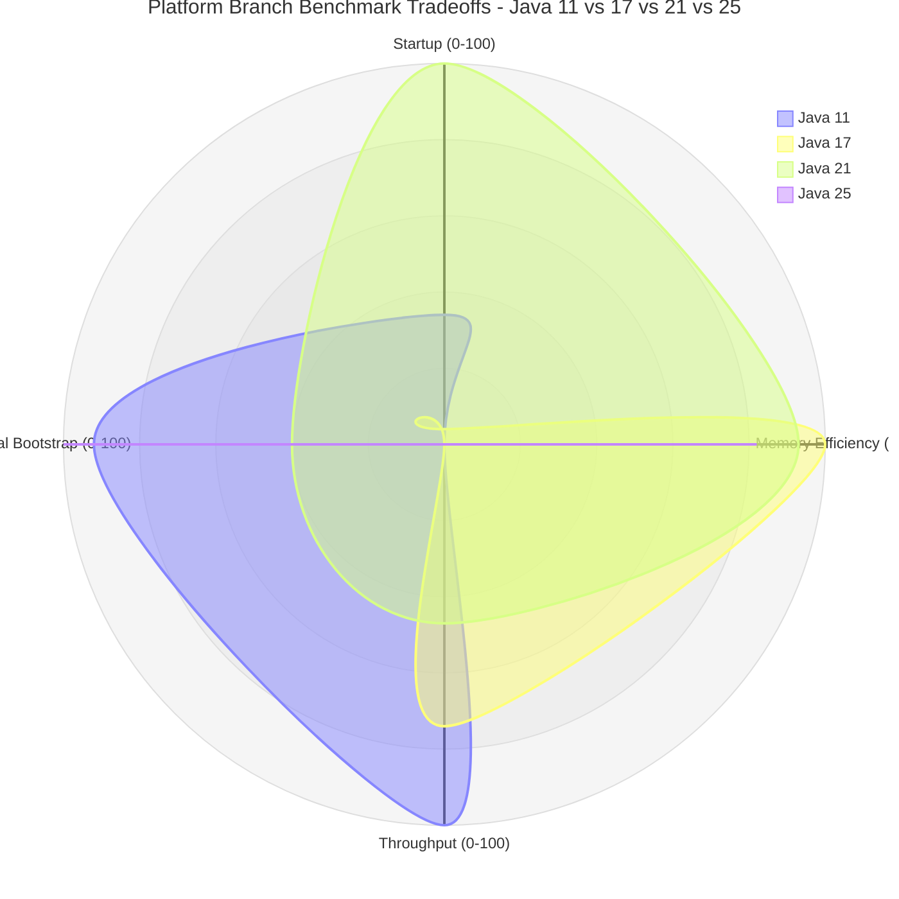

This radar chart shows normalized relative strengths, not raw benchmark numbers. Each axis is scaled from `0` to `100`, where `100` is the strongest branch on that dimension within this Episode 7 benchmark set.

