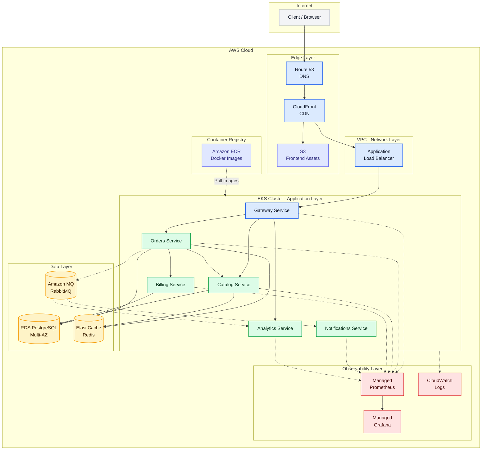

```mermaid
flowchart TB

%% === AcmeCorp Diagram Style Standard ===
classDef client fill:#F3F4F6,stroke:#9CA3AF,stroke-width:1px,color:#111827;
classDef cdn fill:#DBEAFE,stroke:#2563EB,stroke-width:2px,color:#0F172A;
classDef gateway fill:#DBEAFE,stroke:#2563EB,stroke-width:2px,color:#0F172A;
classDef service fill:#DCFCE7,stroke:#16A34A,stroke-width:1.5px,color:#052E16;
classDef infra fill:#FEF3C7,stroke:#F59E0B,stroke-width:1.5px,color:#3B1F00;
classDef observability fill:#FEE2E2,stroke:#DC2626,stroke-width:1.5px,color:#450A0A;
classDef storage fill:#E0E7FF,stroke:#6366F1,stroke-width:1.5px,color:#312E81;

subgraph Internet["Internet"]
    Client[Client / Browser]:::client
end

subgraph AWS["AWS Cloud"]
    subgraph Edge["Edge Layer"]
        Route53[Route 53<br/>DNS]:::cdn
        CloudFront[CloudFront<br/>CDN]:::cdn
        S3Frontend[S3<br/>Frontend Assets]:::storage
    end
    
    subgraph Network["VPC - Network Layer"]
        ALB[Application<br/>Load Balancer]:::gateway
    end
    
    subgraph EKS["EKS Cluster - Application Layer"]
        Gateway[Gateway Service]:::gateway
        Orders[Orders Service]:::service
        Catalog[Catalog Service]:::service
        Billing[Billing Service]:::service
        Notifications[Notifications Service]:::service
        Analytics[Analytics Service]:::service
    end
    
    subgraph Data["Data Layer"]
        RDS[(RDS PostgreSQL<br/>Multi-AZ)]:::infra
        MQ[(Amazon MQ<br/>RabbitMQ)]:::infra
        ElastiCache[(ElastiCache<br/>Redis)]:::infra
    end
    
    subgraph Observability["Observability Layer"]
        Prometheus[Managed<br/>Prometheus]:::observability
        Grafana[Managed<br/>Grafana]:::observability
        CloudWatch[CloudWatch<br/>Logs]:::observability
    end
    
    subgraph Registry["Container Registry"]
        ECR[Amazon ECR<br/>Docker Images]:::storage
    end
end

%% Client flow
Client --> Route53
Route53 --> CloudFront
CloudFront --> S3Frontend
CloudFront --> ALB

%% API Gateway flow
ALB --> Gateway
Gateway --> Orders
Gateway --> Catalog
Gateway --> Analytics

%% Service dependencies
Orders --> Billing
Orders --> Catalog

%% Data layer connections
Orders --> RDS
Catalog --> RDS
Billing --> RDS
Orders --> ElastiCache
Catalog --> ElastiCache
Orders -.-> MQ
MQ -.-> Notifications
MQ -.-> Analytics

%% Observability connections
Gateway -.-> Prometheus
Orders -.-> Prometheus
Catalog -.-> Prometheus
Billing -.-> Prometheus
Notifications -.-> Prometheus
Analytics -.-> Prometheus
Prometheus --> Grafana
EKS -.-> CloudWatch

%% Deployment
ECR -.->|Pull images| EKS
```
