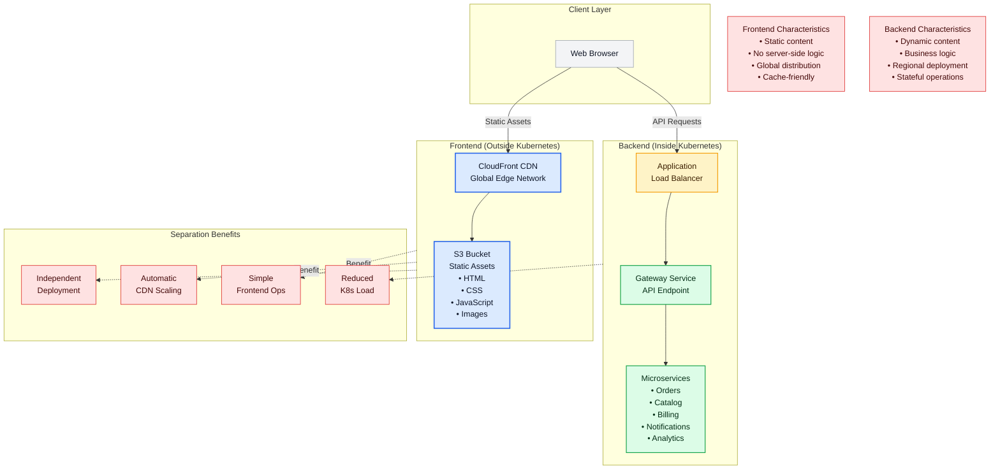

```mermaid
flowchart TB

%% === AcmeCorp Diagram Style Standard ===
classDef client fill:#F3F4F6,stroke:#9CA3AF,stroke-width:1px,color:#111827;
classDef frontend fill:#DBEAFE,stroke:#2563EB,stroke-width:2px,color:#0F172A;
classDef backend fill:#DCFCE7,stroke:#16A34A,stroke-width:1.5px,color:#052E16;
classDef infra fill:#FEF3C7,stroke:#F59E0B,stroke-width:1.5px,color:#3B1F00;
classDef note fill:#FEE2E2,stroke:#DC2626,stroke-width:1px,color:#450A0A;

subgraph Client["Client Layer"]
    Browser[Web Browser]:::client
end

subgraph Frontend["Frontend (Outside Kubernetes)"]
    direction TB
    CF[CloudFront CDN<br/>Global Edge Network]:::frontend
    S3[S3 Bucket<br/>Static Assets<br/>• HTML<br/>• CSS<br/>• JavaScript<br/>• Images]:::frontend
    
    CF --> S3
end

subgraph Backend["Backend (Inside Kubernetes)"]
    direction TB
    ALB[Application<br/>Load Balancer]:::infra
    Gateway[Gateway Service<br/>API Endpoint]:::backend
    Services[Microservices<br/>• Orders<br/>• Catalog<br/>• Billing<br/>• Notifications<br/>• Analytics]:::backend
    
    ALB --> Gateway
    Gateway --> Services
end

subgraph Benefits["Separation Benefits"]
    B1[Independent<br/>Deployment]:::note
    B2[Automatic<br/>CDN Scaling]:::note
    B3[Reduced<br/>K8s Load]:::note
    B4[Simple<br/>Frontend Ops]:::note
end

%% Flow
Browser -->|Static Assets| CF
Browser -->|API Requests| ALB

%% Notes
Frontend -.->|Benefit| B1
Frontend -.->|Benefit| B2
Backend -.->|Benefit| B3
Frontend -.->|Benefit| B4

%% Labels
FrontendLabel[Frontend Characteristics<br/>• Static content<br/>• No server-side logic<br/>• Global distribution<br/>• Cache-friendly]:::note
BackendLabel[Backend Characteristics<br/>• Dynamic content<br/>• Business logic<br/>• Regional deployment<br/>• Stateful operations]:::note
```
