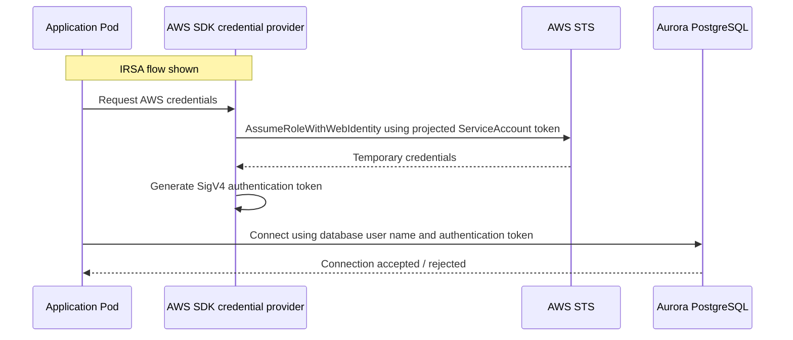

```mermaid
sequenceDiagram
    participant Pod as Application Pod
    participant SDK as AWS SDK credential provider
    participant STS as AWS STS
    participant Aurora as Aurora PostgreSQL

    Note over Pod,SDK: IRSA flow shown
    Pod->>SDK: Request AWS credentials
    SDK->>STS: AssumeRoleWithWebIdentity using projected ServiceAccount token
    STS-->>SDK: Temporary credentials

    SDK->>SDK: Generate SigV4 authentication token
    Pod->>Aurora: Connect using database user name and authentication token

    Aurora-->>Pod: Connection accepted / rejected
```