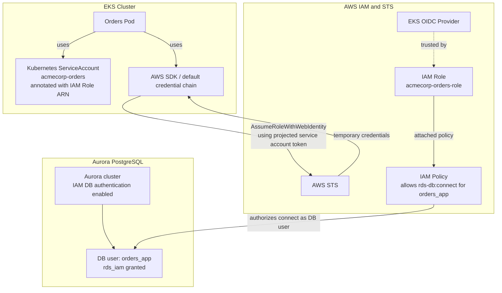

```mermaid
flowchart TD
    subgraph EKS Cluster
        Pod[Orders Pod]
        SA[Kubernetes ServiceAccount<br/>acmecorp-orders<br/>annotated with IAM Role ARN]
        SDK[AWS SDK / default credential chain]
        Pod -->|uses| SA
        Pod -->|uses| SDK
    end

    subgraph AWS IAM and STS
        OIDC[EKS OIDC Provider]
        STS[AWS STS]
        Role[IAM Role<br/>acmecorp-orders-role]
        Policy[IAM Policy<br/>allows rds-db:connect for orders_app]
        Role -->|attached policy| Policy
        OIDC -. trusted by .-> Role
        SDK -->|AssumeRoleWithWebIdentity<br/>using projected service account token| STS
        STS -->|temporary credentials| SDK
    end

    subgraph Aurora PostgreSQL
        Cluster[Aurora cluster<br/>IAM DB authentication enabled]
        DBUser[DB user: orders_app<br/>rds_iam granted]
        Cluster --> DBUser
    end

    Policy -->|authorizes connect as DB user| DBUser
```