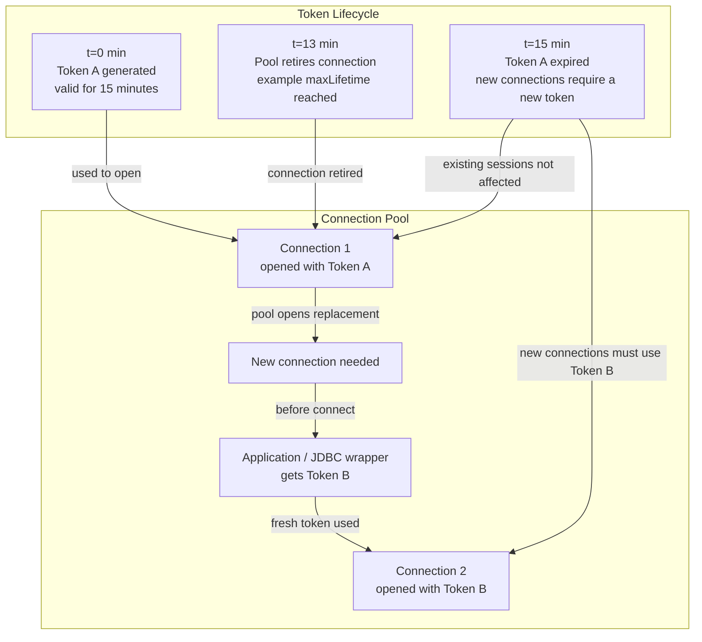

```mermaid
flowchart TD
    subgraph Token Lifecycle
        T0[t=0 min<br>Token A generated<br>valid for 15 minutes]
        T13[t=13 min<br>Pool retires connection<br>example maxLifetime reached]
        T15[t=15 min<br>Token A expired<br>new connections require a new token]
    end

    subgraph Connection Pool
        Conn1[Connection 1<br>opened with Token A]
        NewConn[New connection needed]
        TokenGen[Application / JDBC wrapper\ngets Token B]
        Conn2[Connection 2<br>opened with Token B]
    end

    T0 -->|used to open| Conn1
    T13 -->|connection retired| Conn1
    Conn1 -->|pool opens replacement| NewConn
    NewConn -->|before connect| TokenGen
    TokenGen -->|fresh token used| Conn2
    T15 -->|existing sessions not affected| Conn1
    T15 -->|new connections must use Token B| Conn2
```