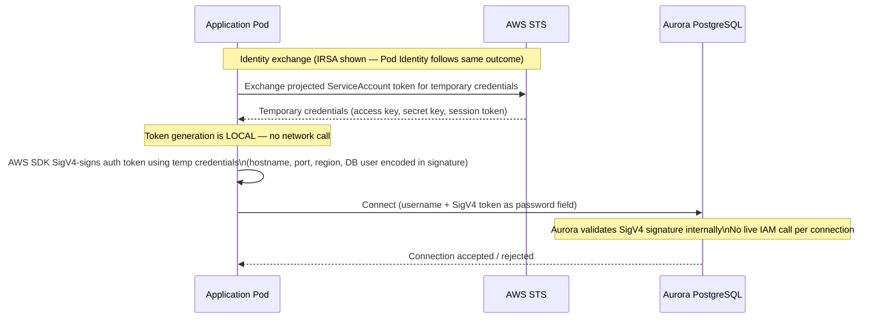
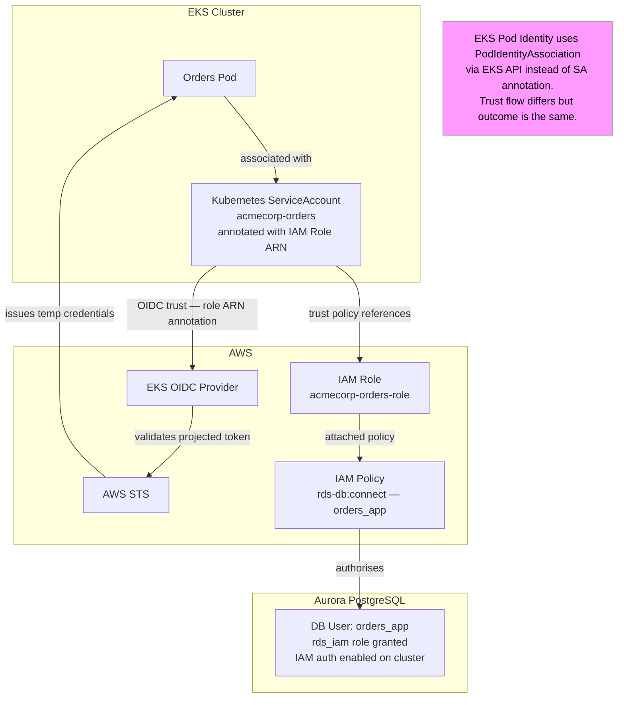
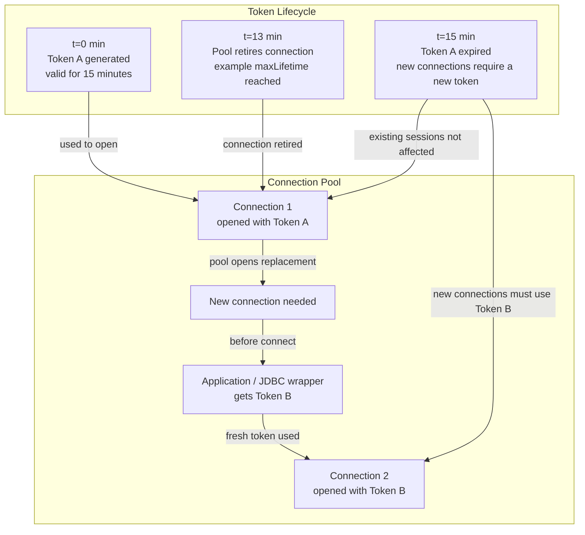

# Episode 9 — Secure Data Plane: Aurora PostgreSQL IAM Auth

## Opening – Passwords do not scale

In the previous episode, we deployed the AcmeCorp platform to AWS. We provisioned Aurora PostgreSQL, configured the VPC, set up the EKS cluster, and wired everything together. The platform runs. Services connect to the database. It works.

But there is a problem hiding in plain sight. The services are authenticating to Aurora with a password. That password lives in AWS Secrets Manager, gets synced into Kubernetes through External Secrets, and lands as an environment variable inside the pod. That is better than hardcoding it in source code, but it is still a password. And passwords have a fundamental operational problem.

Passwords do not expire on their own. They get copied. They appear in logs when someone misconfigures a connection string. They get included in bug reports. They live in CI pipelines, in developer dotfiles, in Slack messages from three years ago. Rotation is supposed to fix this, but rotation is a manual process that teams defer because it is disruptive. The longer a password lives, the more places it has spread to.

Identity-based authentication changes the model entirely. Instead of proving who you are with a secret you know, you prove who you are with an identity you have been granted. AWS IAM authentication for Aurora works exactly this way. A pod does not present a password. It presents a short-lived token derived from its IAM identity. The token expires in fifteen minutes. There is nothing to rotate, nothing to leak long-term, and nothing to copy into a dotfile.

But IAM auth introduces its own constraints. Tokens are short-lived, which means your connection pooling strategy has to account for token expiry. Caching matters. The way you initialize your database connection pool matters. This episode shows how to adopt IAM auth correctly, without breaking your runtime behavior.

---

## The authentication flow – From pod to Aurora

**[DIAGRAM: E09-D01-iam-auth-flow]**

Let me walk through what actually happens when a pod connects to Aurora using IAM authentication.

The pod does not use a database password. Instead, it uses an AWS identity. Using that identity, the AWS SDK generates an authentication token using the caller’s AWS credentials. The authentication token is a string that includes a signature using AWS Signature Version 4 (SigV4) and incorporates the database endpoint, port, AWS Region, and database user name.

The authentication token is used as the password when establishing the PostgreSQL connection. Amazon Aurora verifies that the token was generated using AWS Signature Version 4 (SigV4) and that the AWS identity is authorized to connect to the specified database user.

To connect using IAM database authentication, the IAM principal must have the required permissions, including the ability to connect as the target database user. If the token is valid and the permissions are in place, the connection is established. If the token is expired or the required permissions are not granted, the connection attempt fails.

The authentication token is valid for 15 minutes and must be generated before establishing a new database connection. After the token expires, it cannot be used to create new connections. Connections that were successfully established with a valid token are not affected by the expiration of that token.

Because of this limited validity period, applications must generate a new authentication token before opening new database connections. Connection management must ensure that new connections use a current token.

---

## Kubernetes identity – Pod Identity and IRSA

**[DIAGRAM: E09-D02-irsa-binding]**

Before a pod can generate an authentication token, it must use an AWS identity. On Amazon EKS, there are two supported mechanisms to provide AWS credentials to pods: IAM Roles for Service Accounts (IRSA) and EKS Pod Identity.

Both mechanisms enable pods to access AWS services without embedding long-term credentials. Instead, a Kubernetes ServiceAccount is associated with an IAM role, and pods that use that ServiceAccount can obtain temporary AWS credentials for that role.

With IAM Roles for Service Accounts (IRSA), the ServiceAccount is associated with an IAM role, and the EKS cluster is configured with an OpenID Connect (OIDC) identity provider. The pod uses a projected service account token, which AWS Security Token Service (STS) can use to provide temporary credentials for the associated IAM role.

With EKS Pod Identity, the association between a Kubernetes ServiceAccount and an IAM role is managed through the EKS API. This removes the need to configure and manage the OIDC provider and trust relationship directly. Pods receive AWS credentials for the associated IAM role through this managed integration.

For Amazon Aurora IAM database authentication, the IAM role must allow the appropriate permissions to connect to the database as a specific database user. The permissions are defined using IAM policies and can be scoped to a particular database resource and user.

On the Aurora PostgreSQL side, IAM database authentication must be enabled at the cluster level. In addition, the database user must be granted the `rds_iam` role.

Without that grant, IAM auth will not work even if the IAM policy is correctly configured. The user may still exist with password metadata in the database, but for Aurora PostgreSQL a given application user should be configured for a single authentication method. When the `rds_iam` role is assigned, IAM authentication takes precedence over password authentication for that user.

---

## Token TTL and connection pooling – The constraint that shapes everything

**[DIAGRAM: E09-D03-token-ttl-and-pooling]**

The fifteen-minute validity period of the authentication token is not a problem by itself. It becomes a problem only when the application behaves as if it were still using a static password.

Most applications rely on a connection pool. That pool keeps database connections open and reuses them over time. This works well when authentication does not change. But with IAM database authentication, every new connection must be established using a valid authentication token.

An existing connection remains usable after it has been established. The expiration of the token does not affect connections that are already open. But the moment the pool needs to create a new connection, a valid token is required. If the token is no longer valid, the connection attempt fails.

This is the shift in thinking. The token is not something that is provided once at application startup. It is something that must be generated whenever a new connection is established.

That requirement directly affects how the application manages connections. The application must ensure that a current authentication token is used whenever a new connection is opened. At the same time, connections should be refreshed periodically so that new connections are established using valid tokens.

This configuration ensures that connections are not reused indefinitely and that the pool regularly establishes new connections using a current authentication token.

There is one more constraint that becomes visible only under load. IAM database authentication is designed for controlled connection rates. Workloads that create a high number of new connections in a short period of time need to manage connection behavior carefully.

In these scenarios, Amazon RDS Proxy provides a managed connection layer. It maintains database connections on behalf of the application and reduces the number of direct connection attempts. This allows applications to continue using IAM authentication while stabilizing connection management under load.

---

## Operational implications – What changes and what stays the same

Adopting IAM authentication changes the operational model in a few specific ways, and it is worth being explicit about what those changes are.

Secret rotation largely disappears as a concern for application-level database access. Applications do not need to use database passwords when IAM database authentication is enabled. Access control is managed through IAM policies, and revoking access means removing IAM permissions rather than rotating credentials and ensuring that all consumers have updated their configuration.

Audit improves, but the picture is more nuanced than it might first appear. The call to AWS Security Token Service (STS) that provides temporary credentials is recorded in AWS CloudTrail, allowing you to see which AWS identity assumed which role and when. However, database connection events themselves are not recorded in CloudTrail. CloudTrail provides visibility into the identity plane, not database-level activity. For database-level audit logging, you need Aurora database activity streams or PostgreSQL's `pgaudit` extension. These mechanisms provide visibility into connections and executed statements, depending on the configured audit settings. A complete audit posture requires both layers.

The connection pool configuration becomes a first-class concern. With password-based authentication, connection pool settings are often treated primarily as performance tuning parameters. With IAM authentication, connection management also affects correctness. Each new connection must be established using a valid authentication token. If the pool attempts to open new connections using an expired token, those connection attempts can fail. This behavior needs to be understood, documented, and validated as part of the deployment process.

Local development changes slightly. Developers running services locally cannot use IAM authentication unless they have AWS credentials configured and the appropriate IAM permissions. A common approach is to keep password-based authentication available for local development through a Spring profile, and to use IAM authentication only in deployed environments. The `application-local.yaml` profile uses a password, while the `application-prod.yaml` profile uses the IAM authentication data source configuration.

The observability story stays largely the same. Prometheus continues to scrape the services, and Grafana continues to visualize connection pool metrics. HikariCP exposes metrics such as pool size, active connections, pending threads, and connection acquisition time. These metrics can help identify increases in connection acquisition latency related to authentication or connection management before they become user-visible issues.

---

## Closing – Identity over secrets

We started this episode with a simple observation. Passwords do not scale well operationally. They can be difficult to manage, they may be long-lived, and rotation introduces coordination overhead that teams often defer.

IAM authentication for Aurora replaces the need for database passwords with an identity-based model. The pod uses an AWS identity associated with its Kubernetes ServiceAccount, which is linked to an IAM role. That role is granted permissions to connect to the database as a specific database user. The authentication token generated from this identity is valid for a limited time. It must be generated before establishing a new connection and is not reused indefinitely.

Adopting IAM authentication is not just a configuration change. It requires understanding the token validity period and its implications for connection management. Each new connection must be established using a valid token. Connection pool settings therefore influence not only performance, but also correctness. This requires validating the full identity and connectivity flow before deploying to production, and understanding how authentication-related failures manifest at runtime.

The pattern we followed in this episode is the same pattern we have used throughout this series. Understand the constraint first, and then design the implementation around it. The limited validity period of the authentication token is not a limitation to work around. It is a property of the system that shapes how connections are managed, how the data source is configured, and how deployments are validated.

Identity-based authentication is part of a broader principle. In a well-operated system, access is granted through identity, scoped through policy, and supported by audit mechanisms. IAM authentication for Aurora applies this principle to the database layer.