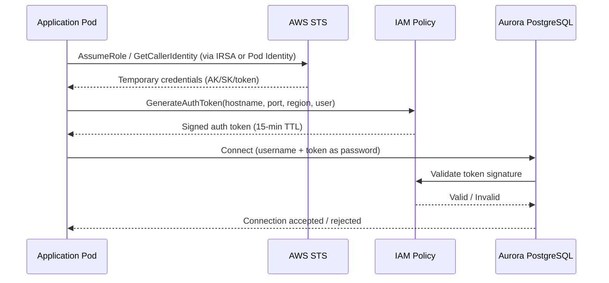
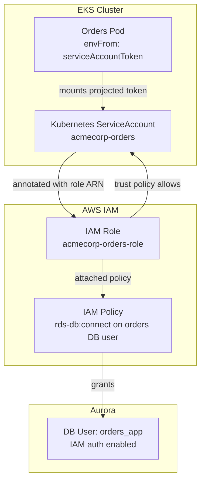
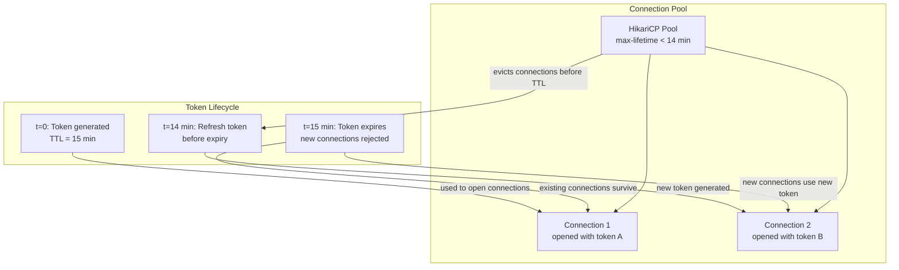

# Episode 9 — Secure Data Plane: Aurora PostgreSQL IAM Auth

## Opening – Passwords do not scale

In the previous episode, we deployed the AcmeCorp platform to AWS. We provisioned Aurora PostgreSQL, configured the VPC, set up the EKS cluster, and wired everything together. The platform runs. Services connect to the database. It works.

But there is a problem hiding in plain sight. The services are authenticating to Aurora with a password. That password lives in AWS Secrets Manager, gets synced into Kubernetes through External Secrets, and lands as an environment variable inside the pod. That is better than hardcoding it in source code, but it is still a password. And passwords have a fundamental operational problem.

Passwords do not expire on their own. They get copied. They appear in logs when someone misconfigures a connection string. They get included in bug reports. They live in CI pipelines, in developer dotfiles, in Slack messages from three years ago. Rotation is supposed to fix this, but rotation is a manual process that teams defer because it is disruptive. The longer a password lives, the more places it has spread to.

Identity-based authentication changes the model entirely. Instead of proving who you are with a secret you know, you prove who you are with an identity you have been granted. AWS IAM authentication for Aurora works exactly this way. A pod does not present a password. It presents a short-lived token derived from its IAM identity. The token expires in fifteen minutes. There is nothing to rotate, nothing to leak long-term, and nothing to copy into a dotfile.

But IAM auth introduces its own constraints. Tokens are short-lived, which means your connection pooling strategy has to account for token expiry. Caching matters. The way you initialize your database connection pool matters. This episode shows how to adopt IAM auth correctly, without breaking your runtime behavior.

---

## The authentication flow – From pod to Aurora

**[DIAGRAM: E09-D01-iam-auth-flow]**



Let me walk through what actually happens when a pod connects to Aurora using IAM authentication.

The pod does not have a password. It has an IAM identity, which we will cover in the next section. Using that identity, it calls the AWS RDS API to generate an authentication token. This is not a network call to Aurora. It is a local cryptographic operation that produces a signed URL, essentially a presigned request that proves the caller has permission to connect as a specific database user.

That token is then used as the password field in the PostgreSQL connection string. Aurora validates the token signature against IAM. If the signature is valid and the IAM policy permits the connection, Aurora accepts it. If the token has expired, or the IAM policy has been revoked, Aurora rejects it.

The token is valid for fifteen minutes. After fifteen minutes, it cannot be used to open a new connection. Existing connections that were opened with a valid token remain open, PostgreSQL does not terminate live connections when a token expires. But if your connection pool tries to open a new connection after the token has expired, it will fail.

This is the constraint that shapes everything else in this episode. Fifteen minutes is short. Your application has to be prepared to refresh the token before it expires, and your connection pool has to be configured to use the refreshed token when it opens new connections.

---

## Kubernetes identity – Pod Identity and IRSA

**[DIAGRAM: E09-D02-pod-identity-to-db]**



Before a pod can generate an auth token, it needs an IAM identity. There are two mechanisms for this on EKS: IRSA, which stands for IAM Roles for Service Accounts, and the newer EKS Pod Identity.

Both mechanisms solve the same problem. A pod running in Kubernetes needs AWS credentials without those credentials being hardcoded or injected as environment variables. The solution is to bind a Kubernetes ServiceAccount to an IAM Role. When a pod uses that ServiceAccount, it gets a projected token that can be exchanged for temporary AWS credentials scoped to that role.

With IRSA, the ServiceAccount is annotated with the IAM Role ARN. The OIDC provider for the EKS cluster is configured as a trusted identity provider in IAM. When the pod presents its projected token to STS, IAM validates it against the OIDC provider and issues temporary credentials for the annotated role.

With EKS Pod Identity, the binding is managed through the EKS API rather than IAM trust policies. The operational model is slightly simpler because you do not need to manage OIDC trust relationships manually, but the end result is the same. The pod gets temporary credentials scoped to a specific IAM role.

For Aurora IAM auth, the IAM role needs a single permission: `rds-db:connect` on the specific database resource and user. The resource ARN encodes the region, account, cluster identifier, and database username. This means the permission is scoped precisely. The Orders service can connect as the `orders_app` database user. It cannot connect as the `billing_app` user. It cannot connect to a different cluster. The IAM policy enforces the same service boundary at the database layer that we established at the application layer.

On the Aurora side, the database user must be created with IAM authentication enabled. This is a PostgreSQL-level configuration. The user exists in the database, but it has no password. Authentication is handled entirely through IAM token validation.

---

## Token TTL and connection pooling – The constraint that shapes everything

**[DIAGRAM: E09-D03-token-ttl-and-pooling]**



The fifteen-minute token TTL is not a problem if you understand it. It becomes a problem when you ignore it and let your connection pool behave as if it has a static password.

A typical connection pool like HikariCP is configured to keep connections alive for a long time. The default `maxLifetime` in HikariCP is thirty minutes. If you use a token to open a connection at time zero, and that connection stays in the pool until time thirty, the token that was used to open it expired at time fifteen. The connection itself is still alive, PostgreSQL does not close it. But if HikariCP tries to open a new connection at time twenty using the same token, Aurora will reject it.

The fix has two parts. First, the token must be refreshed before it expires. The application needs a mechanism to generate a new token and use it when opening new connections. Second, the connection pool must be configured so that connections are evicted and reopened before the token they were opened with expires. Setting `maxLifetime` to something under fourteen minutes ensures that when HikariCP opens a replacement connection, it calls the token generation code again and gets a fresh token.

This is the critical insight. The token is not injected once at startup. It is generated dynamically, every time the pool opens a new connection. The pool's `maxLifetime` controls how often that happens. If `maxLifetime` is shorter than the token TTL, the pool will always be opening new connections with valid tokens.

---

## Code walkthrough – Token generation and injection

Let me show you how this works in practice for a Spring Boot service using HikariCP.

The token generation uses the AWS SDK. The RDS utilities class provides a method that takes the hostname, port, region, and database username and returns a signed token string. This is a local operation. It does not make a network call to Aurora. It uses the credentials available in the environment, which come from the pod's IAM identity through IRSA or Pod Identity, to sign the token.

```java
public class IamAuthDataSourceConfig {

    @Value("${spring.datasource.url}")
    private String jdbcUrl;

    @Value("${cloud.aws.region.static}")
    private String region;

    @Value("${spring.datasource.username}")
    private String dbUsername;

    @Bean
    public DataSource dataSource() {
        HikariConfig config = new HikariConfig();
        config.setJdbcUrl(jdbcUrl);
        config.setUsername(dbUsername);
        config.setMaxLifetime(Duration.ofMinutes(13).toMillis());
        config.setConnectionTimeout(Duration.ofSeconds(10).toMillis());
        config.setPasswordProvider(this::generateAuthToken);
        return new HikariDataSource(config);
    }

    private String generateAuthToken() {
        RdsUtilities rdsUtilities = RdsUtilities.builder()
                .region(Region.of(region))
                .build();

        GenerateAuthenticationTokenRequest request = GenerateAuthenticationTokenRequest.builder()
                .hostname(extractHostname(jdbcUrl))
                .port(extractPort(jdbcUrl))
                .username(dbUsername)
                .build();

        return rdsUtilities.generateAuthenticationToken(request);
    }
}
```

The key detail here is `setPasswordProvider`. HikariCP calls this supplier every time it opens a new connection. Because `maxLifetime` is set to thirteen minutes, connections are evicted and reopened before the fifteen-minute token TTL is reached. Every new connection gets a freshly generated token. The pool never tries to open a connection with an expired token.

The JDBC URL also needs SSL enabled. Aurora IAM auth requires an encrypted connection. The certificate authority bundle for RDS needs to be trusted by the JVM, either by importing it into the trust store or by pointing the JDBC driver at the bundle directly.

```yaml
spring:
  datasource:
    url: jdbc:postgresql://${DB_HOST}:5432/${DB_NAME}?ssl=true&sslmode=verify-full&sslrootcert=/etc/ssl/rds/rds-ca-bundle.pem
    username: orders_app
    hikari:
      maximum-pool-size: 10
      max-lifetime: 780000   # 13 minutes in milliseconds
      connection-timeout: 10000
```

The `sslrootcert` path points to the RDS CA bundle, which is mounted into the pod as a ConfigMap volume. This ensures the connection is encrypted and the certificate is verified against the known Aurora CA.

---

## Kubernetes identity binding – The ServiceAccount and role wiring

Let me show you the Kubernetes side of the identity binding. This is what connects the pod to the IAM role.

```yaml
apiVersion: v1
kind: ServiceAccount
metadata:
  name: acmecorp-orders
  namespace: acmecorp
  annotations:
    eks.amazonaws.com/role-arn: arn:aws:iam::123456789012:role/acmecorp-orders-role
```

The ServiceAccount annotation is the binding point for IRSA. When a pod uses this ServiceAccount, the IRSA webhook injects the projected token volume and the environment variables that the AWS SDK uses to exchange the token for temporary credentials.

```yaml
apiVersion: apps/v1
kind: Deployment
metadata:
  name: orders
  namespace: acmecorp
spec:
  template:
    spec:
      serviceAccountName: acmecorp-orders
      volumes:
        - name: rds-ca
          configMap:
            name: rds-ca-bundle
      containers:
        - name: orders
          image: acmecorp/orders:latest
          volumeMounts:
            - name: rds-ca
              mountPath: /etc/ssl/rds
              readOnly: true
          env:
            - name: DB_HOST
              valueFrom:
                secretKeyRef:
                  name: aurora-endpoint
                  key: host
            - name: DB_NAME
              value: orders
            - name: CLOUD_AWS_REGION_STATIC
              value: eu-west-1
```

Notice what is absent. There is no `DB_PASSWORD` environment variable. There is no secret reference for a database password. The pod has an identity, and that identity is what Aurora will authenticate. The password field in the connection string is generated at runtime from that identity.

The IAM role itself needs two things. A trust policy that allows the EKS OIDC provider to assume it on behalf of the ServiceAccount, and an attached policy that grants `rds-db:connect`.

```json
{
  "Version": "2012-10-17",
  "Statement": [
    {
      "Effect": "Allow",
      "Action": "rds-db:connect",
      "Resource": "arn:aws:rds-db:eu-west-1:123456789012:dbuser:cluster-ABCDEFGHIJKLMNOP/orders_app"
    }
  ]
}
```

The resource ARN in this policy is specific to the cluster identifier and the database username. The Orders service can connect as `orders_app`. It cannot connect as `billing_app`. IAM enforces the service boundary at the database layer.

---

## Validation – Connectivity and failure modes

Let me walk through how to validate that IAM auth is working, and what failure looks like when it is not.

The first validation is confirming that the pod can generate a token at all. You can do this by exec-ing into the pod and running the AWS CLI directly.

```bash
aws rds generate-db-auth-token \
  --hostname $DB_HOST \
  --port 5432 \
  --region eu-west-1 \
  --username orders_app
```

If this returns a long signed token string, the pod's IAM identity is working and the `rds-db:connect` permission is in place. If it returns an access denied error, the IAM role binding is broken, either the ServiceAccount annotation is wrong, the trust policy does not match, or the permission is missing.

The second validation is a direct connection test using the generated token as the password.

```bash
TOKEN=$(aws rds generate-db-auth-token \
  --hostname $DB_HOST \
  --port 5432 \
  --region eu-west-1 \
  --username orders_app)

PGPASSWORD="$TOKEN" psql \
  "host=$DB_HOST port=5432 dbname=orders user=orders_app \
   sslmode=verify-full sslrootcert=/etc/ssl/rds/rds-ca-bundle.pem"
```

If this connects, the full chain is working. Aurora is accepting the token, the SSL certificate is valid, and the database user exists with IAM auth enabled.

Now let me show you what failure looks like. The most common failure mode is an expired token. If you generate a token, wait sixteen minutes, and then try to connect, Aurora will reject it with a `PAM authentication failed` error. This is the error you will see in your application logs if `maxLifetime` is set too high and the pool tries to open a new connection with a stale token.

```
FATAL: PAM authentication failed for user "orders_app"
```

This error is distinct from a wrong password error. It means the token was syntactically valid but expired or the IAM policy was revoked. When you see this in production, the first thing to check is whether `maxLifetime` is configured correctly and whether the pod's IAM identity is still valid.

The second failure mode is a pool exhaustion scenario during token refresh. If all connections in the pool expire at the same time, and token generation is slow because STS is under load, the pool can temporarily run out of connections. This is why `connectionTimeout` matters. Setting it to ten seconds gives the pool time to generate a new token and open a connection before the caller times out.

The third failure mode is a missing or expired IRSA token. The projected ServiceAccount token that IRSA uses also has a TTL, but it is managed by Kubernetes and rotated automatically. If the pod cannot reach the OIDC endpoint to exchange the token, token generation will fail. This is a network-level failure, not an IAM failure, and it will surface as an STS connectivity error rather than an Aurora authentication error.

---

## Operational implications – What changes and what stays the same

Adopting IAM auth changes the operational model in a few specific ways, and it is worth being explicit about what those changes are.

Secret rotation disappears as a concern for database passwords. There are no database passwords for application users. The IAM policy is the access control mechanism, and revoking access means removing the IAM permission, not rotating a password and hoping every consumer has picked up the new value.

Audit improves. Every token generation is an IAM API call, and IAM API calls are logged in CloudTrail. You can see exactly which pod, with which identity, generated a token to connect to which database user, at what time. This is a level of audit detail that password-based auth cannot provide.

The connection pool configuration becomes a first-class concern. With password auth, you set up the pool once and forget it. With IAM auth, `maxLifetime` is a correctness constraint, not just a performance tuning knob. If it is wrong, connections fail. This needs to be documented, tested, and validated as part of the deployment process.

Local development changes slightly. Developers running services locally cannot use IAM auth unless they have AWS credentials configured and the appropriate IAM permissions. The practical approach is to keep password auth available for local development through a Spring profile, and use IAM auth only in the deployed environments. The `application-local.yaml` profile uses a password. The `application-prod.yaml` profile uses the IAM auth data source configuration.

The observability story stays the same. Prometheus still scrapes the services. Grafana still shows connection pool metrics. HikariCP exposes pool size, active connections, pending threads, and connection acquisition time as metrics. If token refresh is causing connection acquisition latency spikes, you will see it in the Grafana dashboard before it becomes a user-facing problem.

---

## Closing – Identity over secrets

We started this episode with a simple observation. Passwords do not scale operationally. They leak, they live too long, and rotation is a tax that teams defer.

IAM authentication for Aurora replaces the password with an identity. The pod proves who it is through its Kubernetes ServiceAccount, which is bound to an IAM role, which has a precisely scoped permission to connect as a specific database user. The token that results from this chain is valid for fifteen minutes and then it is gone. There is nothing to rotate, nothing to leak long-term, and nothing to copy.

But adopting IAM auth is not just a configuration change. It requires understanding the token TTL and its implications for connection pooling. It requires configuring `maxLifetime` correctly. It requires validating the full identity chain before deploying to production. And it requires knowing what failure looks like so you can diagnose it quickly when it happens.

The pattern we followed in this episode is the same pattern we have followed throughout this series. Understand the constraint first. Then design the implementation around it. The fifteen-minute TTL is not a limitation to work around. It is a property of the system that shapes how you configure the pool, how you structure the data source bean, and how you validate the deployment.

Identity-based authentication is one part of a broader principle. In a well-operated system, access is granted through identity, scoped precisely, and auditable by default. IAM auth for Aurora is that principle applied to the database layer.
