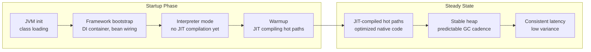

```mermaid
flowchart LR
    subgraph Startup Phase
        S1[JVM init<br>class loading]
        S2[Framework bootstrap<br>DI container, bean wiring]
        S3[Interpreter mode<br>no JIT compilation yet]
        S4[Warmup<br>JIT compiling hot paths]
    end

    subgraph Steady State
        SS1[JIT-compiled hot paths<br>optimized native code]
        SS2[Stable heap<br>predictable GC cadence]
        SS3[Consistent latency<br>low variance]
    end

    S1 --> S2 --> S3 --> S4 --> SS1
    SS1 --> SS2 --> SS3
```