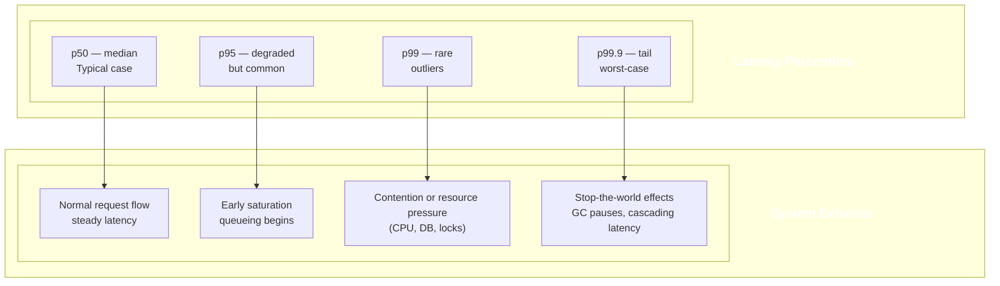

```mermaid
flowchart TD

    subgraph TOP[" "]
        direction TB
        TOPTITLE["Latency Percentiles"]
        TOPROW[" "]
        subgraph TOPBOXES[" "]
            direction LR
            P50["p50 — median<br>Typical case"]
            P95["p95 — degraded<br>but common"]
            P99["p99 — rare<br>outliers"]
            P999["p99.9 — tail<br>worst-case"]
        end
    end

    subgraph BOTTOM[" "]
        direction TB
        BOTTOMTITLE["System Behavior"]
        BOTTOMROW[" "]
        subgraph BOTBOXES[" "]
            direction LR
            T50["Normal request flow<br>steady latency"]
            T95["Early saturation<br>queueing begins"]
            T99["Contention or resource pressure<br>(CPU, DB, locks)"]
            T999["Stop-the-world effects<br>GC pauses, cascading latency"]
        end
    end

    P50 --> T50
    P95 --> T95
    P99 --> T99
    P999 --> T999

    classDef title fill:none,stroke:none,color:#fff,font-size:20px,font-weight:bold;
    classDef spacer fill:none,stroke:none;
    class TOPTITLE,BOTTOMTITLE title;
    class TOPROW,BOTTOMROW spacer;
```