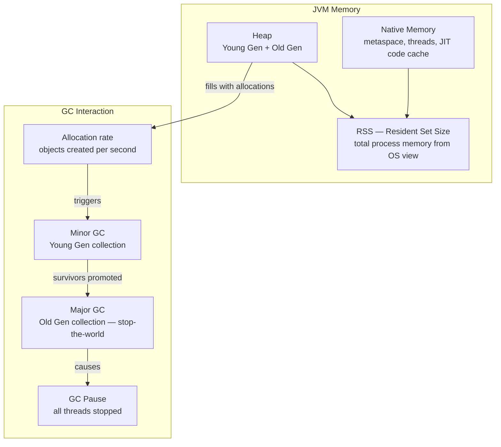

```mermaid
flowchart TD
    subgraph JVM Memory
        Heap[Heap<br>Young Gen + Old Gen]
        Native[Native Memory<br>metaspace, threads, JIT code cache]
        RSS[RSS — Resident Set Size<br>total process memory from OS view]
    end

    subgraph GC Interaction
        Alloc[Allocation rate<br>objects created per second]
        Minor[Minor GC<br>Young Gen collection]
        Major[Major GC<br>Old Gen collection — stop-the-world]
        Pause[GC Pause<br>all threads stopped]
    end

    Heap -->|fills with allocations| Alloc
    Alloc -->|triggers| Minor
    Minor -->|survivors promoted| Major
    Major -->|causes| Pause
    Native --> RSS
    Heap --> RSS
```