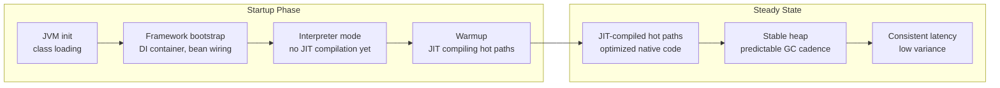
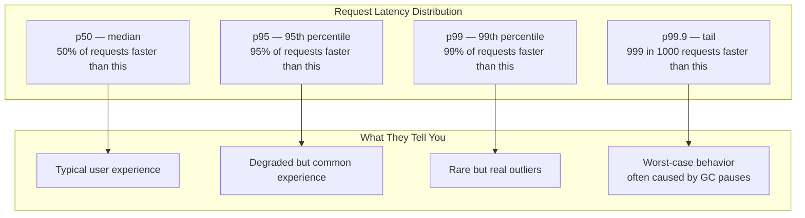
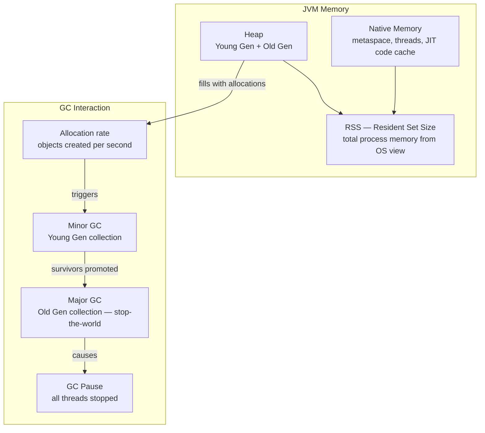

# Episode 10 — Understanding JVM Performance Signals

## Opening – Numbers without context are noise

Throughout this series we have been running services, measuring them, and making decisions based on what we observed. We looked at request latency, heap usage, garbage collection pause times, and startup duration. We used those signals to guide changes.

But there is a skill that sits underneath all of that, and it is easy to skip over. Before you can act on a performance signal, you have to understand what it is actually telling you. And more importantly, you have to understand what it is not telling you.

A changed metric is not the same thing as an explained metric. You can see a number move and still have no idea why it moved. That gap, between observing a change and understanding its cause, is where most performance reasoning goes wrong.

Performance problems are rarely caused by a single thing. They emerge from interactions. Startup behavior affects how a service looks under early load. Memory allocation patterns affect how often garbage collection runs. Garbage collection behavior affects tail latency. Tail latency affects how dependent services behave under backpressure. And when you change the JVM version, the framework version, the persistence path, and the packaging format all at once, every signal in the system can move simultaneously, for different reasons.

This episode is about performance literacy. Not benchmarking, not tooling, not statistical rigor. Those come later. This episode is about learning to look at a performance number and ask the right question instead of drawing the wrong conclusion. That skill is more valuable than any specific tool, because it applies everywhere, regardless of which JVM version you are running, which framework you are using, or which cloud you are deploying to.

---

## Startup time vs steady-state behavior – Two different systems

**[DIAGRAM: E10-D01-startup-vs-steady-state]**

The first concept to get right is the difference between startup time and steady-state behavior. These are not two points on the same curve. They are two fundamentally different operating modes of the JVM, and conflating them leads to bad conclusions.

During startup, the JVM is loading classes, initializing the framework, wiring the dependency injection container, and running in interpreted mode. The JIT compiler has not yet had enough information to compile the hot paths into optimized native code. Everything is slower than it will eventually be. Memory allocation is irregular. Latency is high and variable. If you measure performance during this phase and draw conclusions about steady-state behavior, you will be wrong.

[SHOW: orders-service startup timing output – time-to-ready across benchmark runs]

Steady state is what happens after the JVM has warmed up. The JIT compiler has identified the hot paths and compiled them. The heap has settled into a predictable allocation and collection rhythm. Latency is lower and more consistent. This is the operating mode that matters for production workloads, because production services run for hours or days, not seconds.

The practical implication is that startup time and steady-state throughput are independent concerns. A service can start slowly and perform excellently under load. A service can start quickly and perform poorly under sustained traffic. Optimizing startup time does not improve steady-state performance. Optimizing steady-state performance does not reduce startup time. They require different techniques and different measurements.

But here is the subtlety that matters when you are comparing two versions of a platform. Startup time is not only affected by the JVM. It is also affected by the framework, the packaging format, and what the application does during initialization. A service that switched from an uber-jar to a fast-jar packaging format will start faster, and that improvement has nothing to do with the JVM. A service that added more beans, more database migrations, or more startup validation will start slower, and that too has nothing to do with the JVM. When startup time changes between two benchmark runs, the first question is not which JVM is faster. The first question is what else changed.

[SHOW: Grafana JVM dashboard – already in steady state, scrape interval active]

Startup time is also not something you can read off a live Prometheus dashboard. It is captured separately, through benchmark scripts or container trace artifacts, because by the time the service is scraping metrics, the startup phase is already over. The live dashboard shows you steady-state behavior. Startup is a different measurement, taken in a different way. When you look at the Grafana dashboards for this platform, you are always looking at a service that has already warmed up. Keep that boundary in mind.

---

## Throughput vs latency vs tail latency – Three different questions

**[DIAGRAM: E10-D02-latency-distribution]**

Throughput, latency, and tail latency are three different questions about the same system. They are related, but they are not interchangeable, and optimizing for one can actively harm another.

Throughput is how many requests the system can handle per unit of time. It is a capacity question. A system with high throughput can process a large volume of work. But throughput says nothing about how long any individual request takes.

Latency is how long a single request takes from the caller's perspective. It is a responsiveness question. A system with low latency responds quickly to individual requests. But latency measured as an average hides the distribution. A system where ninety-nine requests complete in one millisecond and one request takes one second has an average latency of around eleven milliseconds. That average is not useful. The one-second request is the one that matters to the user who experienced it.

Tail latency is the behavior at the high percentiles. The p99 latency is the latency that ninety-nine percent of requests are faster than. The p99.9 latency is the latency that 999 out of 1000 requests are faster than. These numbers reveal the outliers, and outliers matter more than averages in distributed systems.

Here is why tail latency matters so much in practice. When a service makes multiple downstream calls to complete a request, the total latency is dominated by the slowest call. If each of five downstream services has a p99 latency of 100 milliseconds, the probability that at least one of them hits that p99 on any given request is much higher than one percent. The tail latencies compound. A system that looks fine in isolation can produce poor end-to-end latency when composed with other services.

In the JVM context, tail latency spikes are often caused by garbage collection pauses. A GC pause stops all application threads for a period of time. Every request that was in flight during that pause experiences the pause as added latency. When you see a latency distribution with a long right tail, GC behavior is one of the first things to investigate.

[SHOW: Grafana p95 latency panel – gateway request latency over time]

But GC is not the only cause. Latency can also move because the request itself changed. If the gateway now fans out to more downstream services for certain request types, or handles errors differently, the latency of those requests will be higher regardless of what the JVM is doing. A slower endpoint is not always a worse endpoint. It may simply be doing more work. That distinction matters enormously when you are comparing two versions of a system where the behavior of the system also changed.

[SHOW: load test output – p95, p99, p99.9 from benchmark harness results]

The dashboards for this platform show p95 latency as the primary signal. That is a useful window into degraded behavior, but it is not the full tail story. What is happening at p99 or beyond is not directly visible here. For that you need load test results or a more detailed histogram. The p95 line tells you something is happening. It does not tell you how bad the worst cases are, and it does not tell you why. Keep that gap in mind when you are reading the charts.

The right question when looking at latency numbers is not what is the average. It is what does the distribution look like, what is causing the tail, and did the work the service is doing actually change.

---

## Memory footprint and allocation patterns – What the heap is telling you

**[DIAGRAM: E10-D03-memory-signal-overview]**

Memory signals are among the most misread signals in JVM performance. The heap size reported by the JVM is not the same as the memory the process is using from the operating system's perspective. Understanding the difference matters when you are sizing containers, setting resource limits in Kubernetes, or comparing memory usage across JVM versions.

The heap is where Java objects live. It is divided into generations. The young generation is where new objects are allocated. Most objects die young, they are allocated, used briefly, and then become unreachable. The garbage collector reclaims them during a minor GC, which is fast and happens frequently. Objects that survive enough minor GC cycles are promoted to the old generation. The old generation is collected less frequently, but when it is collected, the pause is longer.

The allocation rate is how fast new objects are being created. A high allocation rate means the young generation fills up quickly, which means minor GC runs frequently. Frequent minor GC is not necessarily a problem, but it does consume CPU. If the allocation rate is high enough that objects are being promoted to the old generation faster than the old generation can be collected, heap pressure builds and eventually you get a long GC pause or an out-of-memory error.

[SHOW: Grafana heap usage panel – used heap, committed heap, GC pause duration]

Native memory is everything outside the heap. The metaspace holds class metadata. The JIT code cache holds compiled native code. Thread stacks consume native memory. The direct byte buffer pool, used by frameworks like Netty, lives in native memory. The RSS, resident set size, is the total memory the process is using from the operating system's perspective, and it includes both heap and native memory.

This distinction matters in Kubernetes. Container memory limits are enforced by the operating system, not by the JVM, and they apply to the total memory used by the process, not just the Java heap.

If you set the JVM heap to 512 megabytes and the container memory limit to 512 megabytes, the process will almost certainly exceed that limit. The heap is only part of the memory footprint. Metaspace, thread stacks, JIT-compiled code, and other native allocations all contribute to the total.

Once the process crosses the container’s memory limit, the kernel may terminate it with an out-of-memory kill.

A common rule of thumb is to size the container memory limit at roughly 1.5 times the maximum heap size. But that is only a starting point. The actual overhead depends on the workload, the thread model, the framework, and the JVM version.

And it depends on more than just the JVM version. Thread model changes affect RSS too. A service that enables virtual threads will have a different native memory profile than one running on platform threads, because virtual threads are much cheaper to create and their stacks are managed differently. If RSS changes between two benchmark runs and the thread model also changed, you cannot attribute the RSS difference to the JVM alone.

[SHOW: container RSS from benchmark output – orders-service memory across versions]

The Grafana dashboards for this platform show heap metrics from Micrometer. That gives you a clear view of heap usage, GC behavior, and allocation pressure. What it does not show is the full container memory picture. The RSS is not surfaced here. It exists in the offline benchmark artifacts, where container memory is measured separately. So when you are reading the heap charts, remember that you are looking at one part of the memory story. The heap can look healthy while native memory overhead is pushing the container toward its limit. Those two views need to be read together, even if they come from different places.

When you look at the heap metrics, the questions to ask are: what is the allocation rate, how often is GC running, how long are the pauses, and is the heap growing over time or is it stable? A heap that grows steadily over hours is a memory leak. A heap that oscillates in a sawtooth pattern is normal GC behavior. A heap that is consistently near its maximum is a sizing problem.

---

## When multiple things change at once – The hardest interpretation problem

This is the section that most performance guides skip, and it is the one that matters most in practice.

Real platform evolution is not a controlled experiment. When you upgrade a platform from one version to the next, you rarely change only one thing. You upgrade the JVM. You upgrade the framework. You change the packaging. You add new persistence logic. You improve the instrumentation. You fix a bug in the request handling path. All of those changes land together, and then you run the benchmark and look at the numbers.

[SHOW: pom.xml – Spring Boot version and Java version side by side across branches]

The benchmark will show differences. Startup time changed. Latency changed. Memory changed. And the temptation is to attribute all of it to the most visible change, usually the JVM version, because that is the one with the biggest headline.

But that attribution is almost always wrong, or at least incomplete.

Consider the orders service as a concrete example. If the write path for an order now persists idempotency keys and status history records in addition to the order itself, every write request is doing more database work than it used to. The latency of that endpoint will be higher. The allocation rate will be higher. The GC pressure will be higher. None of that is caused by the JVM. It is caused by the application doing more work. If you compare the orders service latency across two benchmark runs without knowing that the write path changed, you will draw the wrong conclusion about what the numbers mean.

[SHOW: OrderService.createOrder – idempotency check, status history insert alongside order write]

The gateway is another good example. If the gateway now fans out to more downstream services for certain request types, or if its error handling became more thorough, the latency of requests that hit those paths will be higher. A gateway that does more work per request is not a slower gateway in the sense that matters. It is a more capable one. But the benchmark does not know that. It just sees higher latency and reports it.

[SHOW: GatewayService – orderDetails fan-out, includeHistory parameter path]

This is the core problem with branch-to-branch benchmark comparisons. You are not running the same application on a newer JVM. You are running a newer application, on a newer JVM, with a newer framework, with different packaging, and possibly with different instrumentation. Every one of those variables can move the numbers. The benchmark output is a summary of all of them combined.

---

## JVM version changes affect signals, not just speed

One of the most important things to understand when comparing performance across JVM versions is that newer JVM versions do not just make things faster. They change the signals themselves.

Garbage collectors have evolved significantly across JVM versions. The G1 collector, which became the default in JDK 9, behaves differently from the parallel collector that was default before it. ZGC and Shenandoah, which became production-ready in later JDK versions, are designed to keep GC pauses under a millisecond regardless of heap size. If you compare GC pause times between JDK 11 and JDK 21, you are not just seeing a performance improvement. You are seeing a different collector with a fundamentally different pause model.

JIT compilation has also improved across versions. Newer JDKs may show shorter startup times or faster warmup in benchmarks, and that is worth measuring. But the cause is not always straightforward to isolate. JIT improvements, class loading changes, and framework initialization all interact. When the startup benchmark shows a difference, treat it as a signal worth noting rather than a confirmed causal statement about the JIT.

Memory footprint has changed too. JDK versions have introduced improvements to object layout, string compression, and class data sharing that can reduce both heap usage and native memory overhead. But as we just discussed, the thread model also affects RSS, and so does the application's allocation behavior. A lower RSS number in a newer benchmark run is a plausible outcome of JVM improvements, but it is also a plausible outcome of packaging changes, thread model changes, or a workload that allocates differently. The number alone does not tell you which.

[SHOW: VirtualThreadsConfig – executor bean and application.yml spring.threads.virtual.enabled]

Virtual threads are a good example of a change that affects multiple signals at once. Enabling them changes how the JVM schedules work, how thread stacks are managed, and how the RSS looks from the outside. It can improve throughput under high concurrency. But it is a thread model change, not a JVM version change, and its effect on the signals is independent of which JDK you are running on.

The practical implication is that when you see a performance comparison between JVM versions, you need to understand what else changed alongside the JVM, not just read the numbers. A 20% throughput improvement might come from a better JIT compiler, a more efficient GC, reduced memory pressure, a lighter request path, or all of the above. Understanding which factor is driving the improvement tells you whether the improvement will hold under your specific workload, or whether it depends on characteristics that your workload does not have.

---

## Benchmark methodology – What the harness measures and what it cannot

There is one more thing worth understanding before you read benchmark output: the benchmark harness itself is part of the system, and it can change too.

[SHOW: bench/run-matrix.sh – startup measurement block and load measurement block]

If the harness adds better readiness gating between runs, the results become more reliable because you are no longer accidentally measuring a service that has not finished warming up. That is an improvement. But it also means the new results are not directly comparable to older results that were collected without that gating. The numbers changed, but not because the application changed. The measurement improved.

The same applies to instrumentation. If the services now expose more detailed metrics, or if the load generator captures latency at a finer granularity, the picture you get is more accurate. But more accurate is not the same as higher or lower. A more precise measurement of the same behavior can look different from a coarser measurement of the same behavior, and that difference is an artifact of the measurement, not the system.

This is not a reason to distrust benchmarks. It is a reason to understand what a benchmark run actually represents. When you compare two sets of results, the first question is always: were they collected under the same conditions, with the same harness, measuring the same things? If the answer is no, the comparison is informative but not conclusive. It tells you the direction of change. It does not tell you the magnitude with precision.

---

## Reading a real dashboard – What to look for and what to ignore

Let me walk through how to read a performance dashboard with these concepts in mind.

The first thing to establish is the time window. The live dashboard shows steady-state behavior. Startup is already over by the time metrics are being scraped. But if the service was restarted recently and the window includes the first few minutes of operation, the numbers may still reflect the tail end of warmup rather than true steady state. Narrow the window to a period of stable operation before drawing conclusions.

[SHOW: Grafana – latency, GC pause, and heap panels side by side]

The second thing to look at is the latency signal. The dashboard shows p95, which tells you how the system behaves for the large majority of requests. A rising p95 is a meaningful signal. But p95 is not the full picture. It does not tell you what is happening at p99 or beyond, and those are the percentiles where GC pauses tend to show up most clearly. If you want to understand the tail, you need to look at the load test results alongside the dashboard, not just the dashboard alone.

The third thing to look at is the GC metrics. How often is GC running? How long are the pauses? Is the old generation growing over time or is it stable? A stable old generation with regular minor GC is healthy. An old generation that grows steadily until a major GC clears it is a sign of object promotion pressure. An old generation that never shrinks is a memory leak.

The fourth thing to look at is the allocation rate. A high allocation rate is not inherently a problem, but it is a signal. If the allocation rate is high and the GC pause times are also high, the two are likely related. If the allocation rate is high but GC pauses are short, the GC is keeping up. If the allocation rate drops suddenly, something changed in the workload, either traffic decreased or a code path that was allocating heavily is no longer being called.

The fifth thing to look at is the relationship between metrics. Latency spikes that align with GC pauses tell a different story than latency spikes that align with upstream dependency timeouts. Memory growth that correlates with request volume tells a different story than memory growth that continues after traffic stops. The signals are most useful when you look at them together, not in isolation. And some signals, like container memory or startup time, are not in this view at all. Knowing what is absent from the dashboard is just as important as knowing how to read what is there.

---

## What these signals allow you to conclude — and what they do not

This is the part that is most often skipped, and it is the most important. Every performance measurement has a scope, and conclusions drawn outside that scope are not valid.

A measurement taken on one JVM version does not tell you how the same code will behave on a different JVM version. The runtime is part of the system. Changing the runtime changes the behavior.

A measurement taken under one workload shape does not tell you how the system will behave under a different workload shape. A service that performs well under uniform low-concurrency traffic may behave very differently under bursty high-concurrency traffic. The GC behavior, the JIT compilation profile, and the connection pool behavior all depend on the workload.

A measurement taken in a container with specific resource limits does not tell you how the system will behave with different limits. The JVM adapts its behavior to the available memory and CPU. A service running with 512 megabytes of heap will have different GC behavior than the same service running with 2 gigabytes of heap.

A single measurement does not tell you about variance. A service that has a p95 latency of 5 milliseconds might have a p99.9 latency of 500 milliseconds. The p95 is not the full story. The shape of the distribution beyond what the dashboard shows is the story, and for that you need the load test data.

And a comparison between two benchmark runs does not tell you which variable caused the difference, unless you controlled for all the others. If the JVM changed and the framework changed and the persistence path changed and the packaging changed, the benchmark result reflects all of those changes together. Attributing the result to any single one of them requires more evidence than the benchmark alone can provide.

What performance signals do allow you to conclude is whether the system is behaving consistently, whether there are outliers that need investigation, whether resource usage is growing in a way that suggests a leak, and whether a change you made improved or degraded the metrics you care about. They are diagnostic tools, not verdicts. A correlation between two signals is a reason to investigate, not a confirmed cause. And a difference between two benchmark runs is a reason to ask what changed, not a reason to declare a winner.

---

## Closing – Reading signals in context

We have covered a lot of ground in this episode without writing a single benchmark or running a single load test. That was deliberate.

Performance literacy is the prerequisite for performance work. If you do not understand what startup time and steady-state behavior mean, you will optimize the wrong thing. If you do not understand the difference between p95 and tail latency, you will miss the problems that matter most to users. If you do not understand how GC behavior affects the signals you are reading, you will misdiagnose the cause of latency spikes. And if you do not understand that a benchmark comparing two branches of a platform is comparing many things at once, you will draw confident conclusions from ambiguous evidence.

The skill is not collecting more metrics. Dashboards are easy to build. Benchmark harnesses are easy to run. The hard part is knowing what a number actually means when you see it move. That requires knowing what changed beneath it, not just what the number says.

[SHOW: combined dashboard view – latency, GC pause, heap usage together]

The signals we looked at in this episode, startup phase versus steady state, latency percentiles, allocation rate, GC pause behavior, heap stability, the gap between heap and total container memory, and the relationship between workload shape and observed latency, are the vocabulary of JVM performance. They appear in every dashboard, every profiler output, and every benchmark result. Understanding what they mean, and understanding what each view does and does not show you, is what allows you to ask the right question when something looks wrong.

In the next episode, we will build on this foundation. We will look at how to construct measurements that are actually valid, how to control for the variables that affect JVM performance, and how to draw conclusions that hold up under scrutiny. But that work only makes sense if you already understand what you are measuring and why it matters.

Understand the signals first. Then measure.
