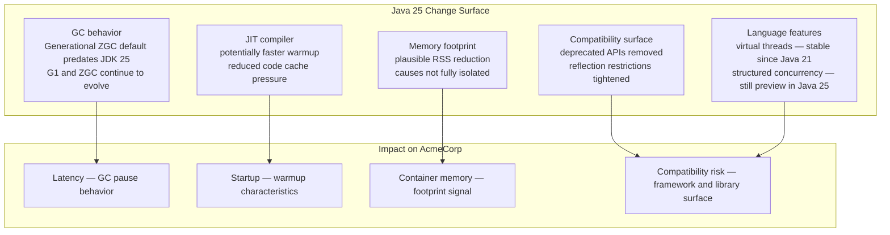

```mermaid
flowchart TD
    subgraph Java 25 Change Surface
        GC[GC behavior<br>Generational ZGC default predates JDK 25<br>G1 and ZGC continue to evolve]
        JIT[JIT compiler<br>potentially faster warmup<br>reduced code cache pressure]
        MEM[Memory footprint<br>plausible RSS reduction<br>causes not fully isolated]
        LANG[Language features<br>virtual threads — stable since Java 21<br>structured concurrency — still preview in Java 25]
        COMPAT[Compatibility surface<br>deprecated APIs removed<br>reflection restrictions tightened]
    end

    subgraph Impact on AcmeCorp
        LAT[Latency — GC pause behavior]
        START[Startup — warmup characteristics]
        RSS[Container memory — footprint signal]
        RISK[Compatibility risk — framework and library surface]
    end

    GC --> LAT
    JIT --> START
    MEM --> RSS
    COMPAT --> RISK
    LANG --> RISK
```