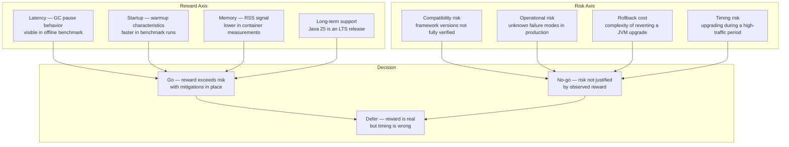

```mermaid
flowchart TD
    subgraph Reward Axis
        R1[Latency — GC pause behavior<br>visible in offline benchmark]
        R2[Startup — warmup characteristics<br>faster in benchmark runs]
        R3[Memory — RSS signal<br>lower in container measurements]
        R4[Long-term support<br>Java 25 is an LTS release]
    end

    subgraph Risk Axis
        X1[Compatibility risk<br>framework versions not fully verified]
        X2[Operational risk<br>unknown failure modes in production]
        X3[Rollback cost<br>complexity of reverting a JVM upgrade]
        X4[Timing risk<br>upgrading during a high-traffic period]
    end

    subgraph Decision
        GO[Go — reward exceeds risk<br>with mitigations in place]
        NOGO[No-go — risk not justified<br>by observed reward]
        DEFER[Defer — reward is real<br>but timing is wrong]
    end

    R1 & R2 & R3 & R4 --> GO
    X1 & X2 & X3 & X4 --> NOGO
    GO & NOGO --> DEFER
```