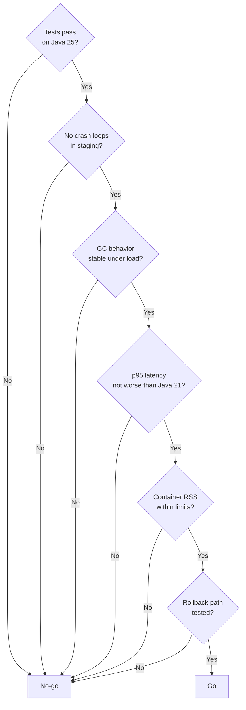

```mermaid
flowchart TD
    C1{Tests pass<br>on Java 25?}
    C2{No crash loops<br>in staging?}
    C3{GC behavior<br>stable under load?}
    C4{p95 latency<br>not worse than Java 21?}
    C5{Container RSS<br>within limits?}
    C6{Rollback path<br>tested?}

    C1 -->|No| NOGO[No-go]
    C1 -->|Yes| C2
    C2 -->|No| NOGO
    C2 -->|Yes| C3
    C3 -->|No| NOGO
    C3 -->|Yes| C4
    C4 -->|No| NOGO
    C4 -->|Yes| C5
    C5 -->|No| NOGO
    C5 -->|Yes| C6
    C6 -->|No| NOGO
    C6 -->|Yes| GO[Go]
```