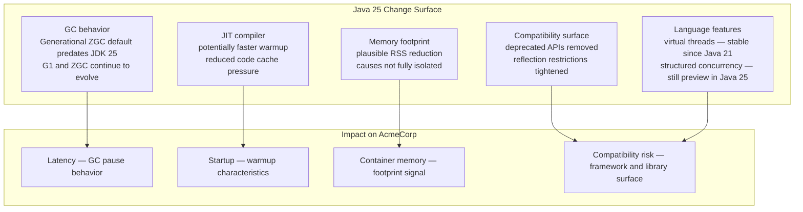
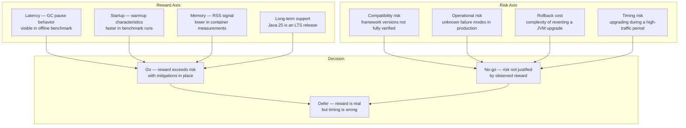
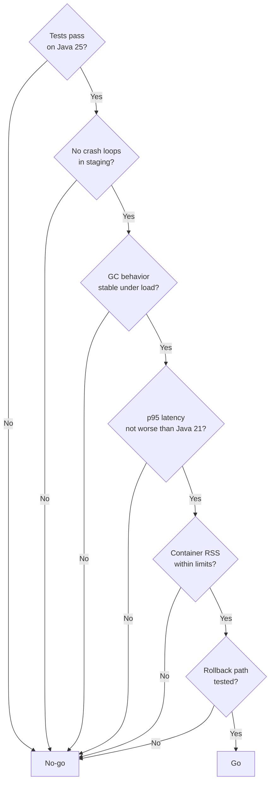

# Episode 11 — Cutting Edge JVMs: Java 21 vs Java 25

## Opening – Upgrades are decisions, not lottery tickets

In the previous episode, we built the vocabulary for reading JVM performance signals. We talked about what startup time, latency percentiles, heap behavior, and GC pauses actually mean, and what each of those signals does and does not tell you. That vocabulary matters now, because this episode is about applying it to a real decision.

Java 25 is a new major JVM release. The release notes are long. The JEP list is impressive. The blog posts are enthusiastic. And none of that is a reason to upgrade.

A JVM upgrade is not a performance lottery ticket. You do not pull the lever and hope for a better number. It is a risk-managed decision, and like any risk-managed decision, it requires evidence. What changed? What does that change mean for your specific workload? What could go wrong? And is the potential upside worth the operational cost of finding out?

This episode is about how to answer those questions for the AcmeCorp platform, using the benchmark infrastructure we have built and the signals we learned to read in the previous episode. We are going to look at what changed between Java 21 and Java 25, run the comparison, interpret the results honestly, and apply a structured go/no-go check before making a recommendation.

The goal is not to tell you that Java 25 is better or worse. The goal is to show you how to find out for yourself, on your own workload, with your own evidence.

---

## What changed between Java 21 and Java 25 – The change surface

**[DIAGRAM: E11-D01-java21-vs-java25-change-surface]**

Before running a single benchmark, it is worth understanding what the change surface actually looks like. Not every change in a JVM release affects every workload. Some changes are relevant to your platform. Some are not. Knowing which is which tells you where to look in the benchmark results and what to be cautious about.

The GC story between Java 21 and Java 25 is more nuanced than a single headline change. Generational ZGC is not a Java 25 introduction. It became the default ZGC mode in an earlier release. What continues to evolve across JDK versions is the tuning and behavior of both G1 and ZGC under different workload shapes. If you are running with ZGC enabled, generational mode is already active on modern JDKs. The question for the benchmark is whether the GC behavior on Java 25 is measurably different from Java 21 under the same load, not whether a specific named feature has arrived.

The JIT compiler changes are harder to attribute precisely. Java 25 may show shorter startup times or faster warmup in the benchmarks, and that is worth measuring. But the cause is not always straightforward to isolate. JIT improvements, class loading changes, and framework initialization all interact. When the startup benchmark shows a difference, treat it as a signal worth noting rather than a confirmed causal statement about the JIT.

The memory footprint picture is similar. RSS differences between Java 21 and Java 25 are plausible and worth measuring in the offline container memory benchmarks. Object layout and heap representation have continued to improve across JDK versions. But the specific cause of any RSS difference you observe in the benchmark is not something the harness can prove. It is a directional signal, not a diagnosis.

On the language side, virtual threads are not a Java 25 feature. They became stable in Java 21. If the platform has not yet adopted them, that is a separate migration decision, not something Java 25 introduces. Structured concurrency is still in preview in Java 25. It is not a stable API, and it should not be treated as a production-ready feature for this platform.

The compatibility surface is where the risk lives. Java 25 continues the trend of tightening access to internal APIs, removing deprecated methods, and restricting reflection in ways that affect frameworks. The platform runs Spring Boot 3.3.4 and Quarkus 3.15.0. Java 25 support for those specific versions should be treated as provisional until explicitly verified. Before the benchmark results matter at all, the platform has to actually run on Java 25 without errors. That is the first gate, and it is not a performance question.

---

## The version matrix setup – How the comparison is structured

Let me show you how the benchmark comparison is structured. The benchmark path in this repository is local, running through a Compose-based harness rather than against the deployed AWS environment. The entry point is `bench/run-matrix.sh`, which drives the comparison across the java21 and java25 matrix entries.

It is worth being precise about what the harness controls and what it does not. The matrix compares branches, which means there can be configuration drift between the two versions beyond just the JDK. The harness does not guarantee that the only variable is the JVM. That is the ideal, and it is worth aiming for, but it is not something the current setup can fully enforce. When you read the results, keep that in mind. A difference in the output could reflect a JVM change, a configuration difference, or both.

The load generation in the harness uses wrk or hey, not k6. k6 is part of the live observability stack for the running platform. The benchmark harness is a separate tool with a different purpose. Startup is measured offline by timing the container from cold start to first successful health check. Throughput and latency are measured offline by the load generator against the running container. Container memory is captured from docker stats after the service has been running under load. None of these measurements come from Prometheus or Grafana. They are all offline artifacts produced by the harness.

The number of runs per version and the averaging behavior depend on the current harness configuration. Before drawing conclusions from the output, check what the harness actually did. A single run per version is not enough to account for JVM variance, especially around JIT compilation timing. If the harness ran only once, the results are directional at best. If it ran multiple times, look at the spread across runs before trusting the average.

One additional constraint worth naming: the Quarkus catalog service image is currently hardcoded to Java 21 in the repository. That service is not part of the Java 25 comparison path. The benchmark covers the services that are included in the matrix, not the full platform.

---

## Benchmark comparison – Reading the results

Let me walk through what the benchmark output looks like and how to read it.

The startup benchmark output shows time-to-ready for each version. If Java 25 is consistently faster across runs, that is a signal worth noting. It is consistent with the kinds of JIT and class loading improvements that have accumulated across recent JDK versions. The difference is most meaningful for services that restart frequently, for example during rolling deployments or after a crash loop. For a service that runs for days without restarting, the startup difference is a one-time cost that quickly becomes irrelevant.

The throughput and latency output shows requests per second and p95 latency under the load generator profile. This is the number that matters most for a production API service. If Java 25 shows a lower p95 under the same load, that is a real signal. If the numbers are within the variance of the runs, the difference is not meaningful and should not be treated as one.

The container memory output shows RSS after a period of steady load. A lower RSS on Java 25 means you can either reduce the container memory limit or run more pods on the same node. The direction matters even if the magnitude is modest. But remember that the harness measures RSS from docker stats, not from inside the JVM. The number reflects the full container footprint, not just the heap.

What you are looking for in these results is not a headline number. You are looking for consistency across runs, a clear directional signal in the metrics that matter for your workload, and the absence of anomalies that would suggest instability. A result that shows Java 25 is faster on throughput but has one run with a p95 spike that the others do not have is not a clean result. That spike needs an explanation before you can trust the average.

---

## Risk vs reward – The decision matrix

**[DIAGRAM: E11-D02-risk-reward-decision-matrix]**

The benchmark results give you the reward side of the decision. Now let me talk about the risk side, because that is where most upgrade decisions go wrong.

The first risk is compatibility. Java 25 tightens access to internal APIs and removes deprecated methods that were still present in Java 21. If any of the platform's dependencies use those APIs, the service will fail at startup or at runtime in ways that may not be immediately obvious. The platform runs Spring Boot 3.3.4 and Quarkus 3.15.0. Whether those specific versions are fully compatible with Java 25 needs to be verified explicitly. Do not assume compatibility based on the framework name alone. Check the framework's own compatibility matrix for the exact version in use.

The practical way to do this is to run the full test suite against Java 25 before running any benchmarks. If the tests pass, the compatibility surface is likely clean for the paths the tests exercise. If they fail, the failure tells you exactly where the incompatibility is. Fix it or wait for the dependency to release a compatible version. Do not benchmark a version that does not pass the tests.

The second risk is operational unknowns. A JVM version that performs well in a benchmark environment may behave differently under production traffic patterns, with production data volumes, and with production dependency latencies. The benchmark is a controlled approximation. Production is the real thing. The gap between them is where surprises live.

The third risk is rollback cost. Rolling back a JVM upgrade is not as simple as rolling back an application deployment. The JVM is baked into the container image. Rolling back means rebuilding and redeploying the previous image. In a GitOps model this is straightforward, you revert the image tag change and let the reconciler apply it. But it is still a deployment event, and deployment events carry their own risk. The rollback path needs to be tested before the upgrade is applied, not after something goes wrong.

The fourth risk is timing. Upgrading a JVM during a high-traffic period, before a major release, or when the team is already managing another change is a bad idea regardless of how good the benchmark results look. The upgrade should happen during a period of low operational pressure, with the team available to respond if something unexpected happens.

---

## Operational stability checks – The go/no-go checklist

**[DIAGRAM: E11-D03-operational-stability-checks]**

Let me walk through the checklist against the AcmeCorp platform. Not to declare a verdict, but to show what each check actually requires and where the current state of the repository leaves open questions.

The first check is whether the tests pass on Java 25. This is the gate that everything else depends on. Run the full test suite, including integration tests that exercise the database connection, the message broker, and the observability wiring. A unit test suite that passes is not sufficient. The compatibility risk lives in the integration surface. For this platform, with Spring Boot 3.3.4 and Quarkus 3.15.0, that verification has not yet been completed. It is the first thing that needs to happen before any other check is meaningful.

The second check is whether the service runs without crash loops under load. Start the service on Java 25, send it representative traffic, and watch the restart count. A service that crashes and restarts under load is not ready for production regardless of what the benchmarks show. Crash loops under load often indicate memory pressure that the benchmark environment did not reproduce, or a runtime error triggered by a specific code path that the load generator did not exercise. This check requires a deliberate staging run, not just a benchmark pass.

The third check is whether GC behavior is stable under load. Look at the GC pause frequency and duration during the benchmark run. Erratic pause behavior or unexpected full GC events are a signal that something is wrong with the configuration or that the workload is triggering an edge case. What you are looking for is stability and consistency, not necessarily a specific improvement over Java 21.

The fourth check is whether p95 latency is not worse than the Java 21 baseline. This is a floor, not a ceiling. The goal is not to require an improvement. The goal is to ensure there is no regression. A JVM upgrade that makes latency worse is not acceptable even if the benchmark showed a throughput improvement. Throughput and latency are different questions, and a latency regression affects users directly.

The fifth check is whether the container RSS is within the configured memory limits. If the Java 25 RSS is higher than expected, the container memory limit may need to be adjusted before deploying to production. An OOM kill in production because the memory limit was sized for the Java 21 footprint is an avoidable failure.

The sixth check is whether the rollback path has been tested. Before applying the upgrade to production, verify that you can revert to the Java 21 image and that the revert deploys cleanly. In a GitOps model this means reverting the image tag in the deployment manifest, opening a pull request, merging it, and confirming that the reconciler applies the previous image without errors. Do this in staging before doing it in production.

---

## Applying the checklist to the platform

Let me be direct about where the platform stands against this checklist right now.

The compatibility check is open. Spring Boot 3.3.4 and Quarkus 3.15.0 have not been verified against Java 25 in this repository. That is the first thing to resolve. Until the test suite runs cleanly on Java 25, the remaining checks are premature.

The benchmark results from the harness give partial answers to checks three, four, and five. The offline measurements show startup time, p95 latency, and RSS for both versions. Those numbers are directional signals. Whether they hold under a more sustained load, with the full service graph running, is a separate question that the benchmark harness alone cannot answer.

The crash loop check and the rollback check are not addressed by the benchmark harness at all. They require a deliberate staging run and a deliberate rollback exercise. Neither of those has been documented as completed in the current repository state.

The honest conclusion is that the benchmark results are promising enough to justify continuing the evaluation. But several checks remain open, and a full go decision would be premature. The next step is to run the test suite on Java 25, resolve any compatibility issues, and then run a sustained staging validation before treating the upgrade as production-ready.

That is not a failure of the process. That is the process working correctly. The checklist exists to surface exactly these gaps before they become production incidents.

---

## What is intentionally deferred

This episode has not gone deep into individual JEPs. The Java Enhancement Proposal list for Java 25 is long, and most of the entries are not directly relevant to a platform like AcmeCorp. Virtual threads became stable in Java 21, and the AcmeCorp services use traditional thread-per-request models. The migration to virtual threads is a separate decision with its own tradeoffs, and it is not something Java 25 introduces. Structured concurrency remains in preview in Java 25 and is not a stable API for production adoption.

Vendor-specific early access builds are also out of scope here. Amazon Corretto, Eclipse Temurin, and other distributions will each have their own release timelines and their own patches on top of the OpenJDK baseline. The comparison in this episode uses Temurin because it is what the platform already uses. Switching distributions is a separate decision that requires its own compatibility and stability checks.

The point is not to evaluate every feature in the release. The point is to evaluate the features that affect your workload, measure the ones that can be measured, and make a decision based on evidence rather than release notes.

---

## Closing – Evidence over enthusiasm

Every major JVM release comes with a wave of enthusiasm. Benchmark numbers from the OpenJDK team, blog posts from framework authors, conference talks about new features. All of that is useful context, but none of it is a substitute for running the comparison yourself on your own workload.

The process we followed in this episode is the same process you should follow for any JVM upgrade. Understand the change surface honestly, including what is new and what predates this release. Check compatibility before benchmarking. Run the comparison under the best-controlled conditions your harness supports. Read the results honestly, including the variance and the gaps. Apply the go/no-go checklist. Test the rollback path. Then decide.

For the AcmeCorp platform, the benchmark results are directional and worth acting on. But the checklist is not complete. Compatibility needs to be verified, a staging run needs to happen, and the rollback path needs to be exercised. The upgrade is not ready to ship today. It is ready to be validated properly.

That distinction matters. A process that tells you what still needs to happen is more useful than one that declares victory prematurely. The checklist is not a formality. It is the thing that keeps a promising benchmark result from becoming a production incident.

Upgrades are decisions. Make them with evidence.
