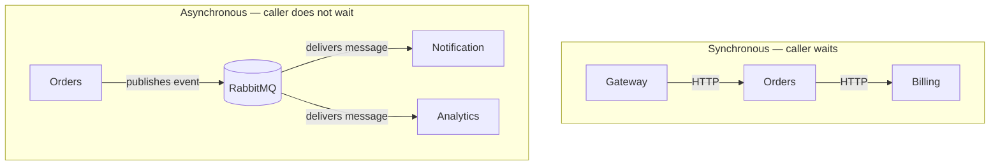

```mermaid
flowchart TD
    subgraph Synchronous["Synchronous — caller waits"]
        GW[Gateway] -->|HTTP| ORD[Orders]
        ORD -->|HTTP| BILL[Billing]
    end

    subgraph Asynchronous["Asynchronous — caller does not wait"]
        ORD2[Orders] -->|publishes event| MQ[(RabbitMQ)]
        MQ -->|delivers message| NOTIF[Notification]
        MQ -->|delivers message| ANAL[Analytics]
    end
```