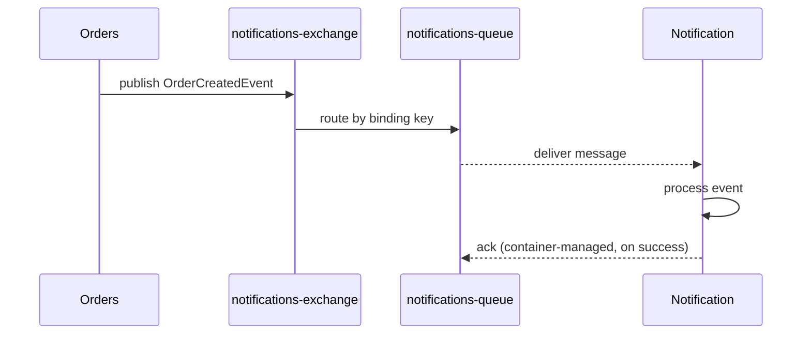

```mermaid
sequenceDiagram
    participant Orders
    participant Exchange as notifications-exchange
    participant Queue as notifications-queue
    participant Notification

    Orders->>Exchange: publish OrderCreatedEvent
    Exchange->>Queue: route by binding key
    Queue-->>Notification: deliver message
    Notification->>Notification: process event
    Notification-->>Queue: ack (container-managed, on success)
```