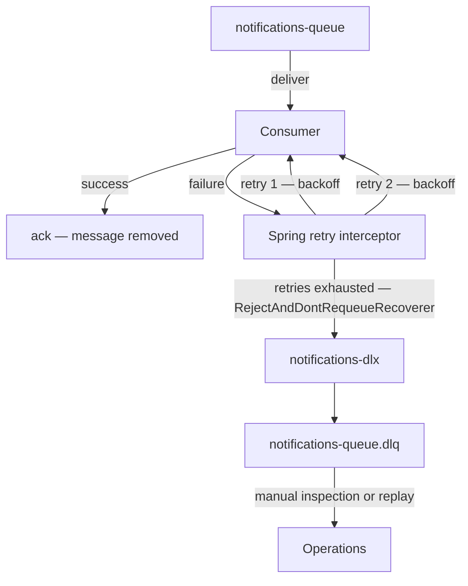

```mermaid
flowchart TD
    Q[notifications-queue] -->|deliver| C[Consumer]
    C -->|success| ACK[ack — message removed]
    C -->|failure| RI[Spring retry interceptor]
    RI -->|retry 1 — backoff| C
    RI -->|retry 2 — backoff| C
    RI -->|retries exhausted — RejectAndDontRequeueRecoverer| DLX[notifications-dlx]
    DLX --> DLQ[notifications-queue.dlq]
    DLQ -->|manual inspection or replay| OPS[Operations]
```