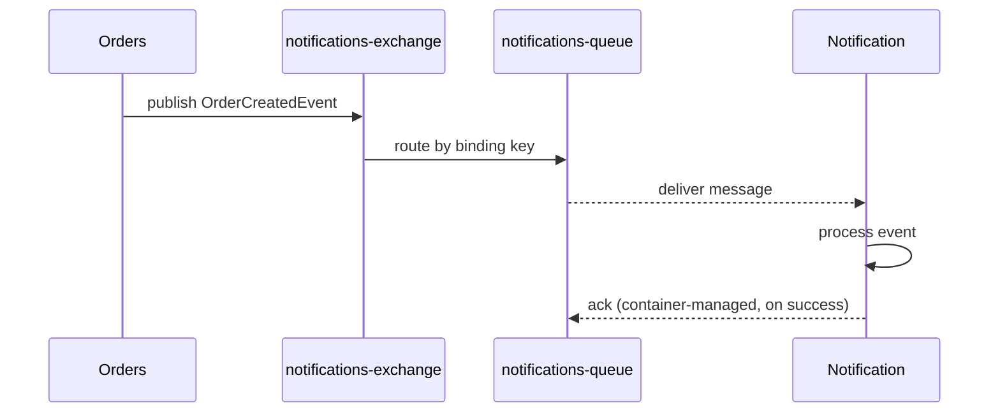
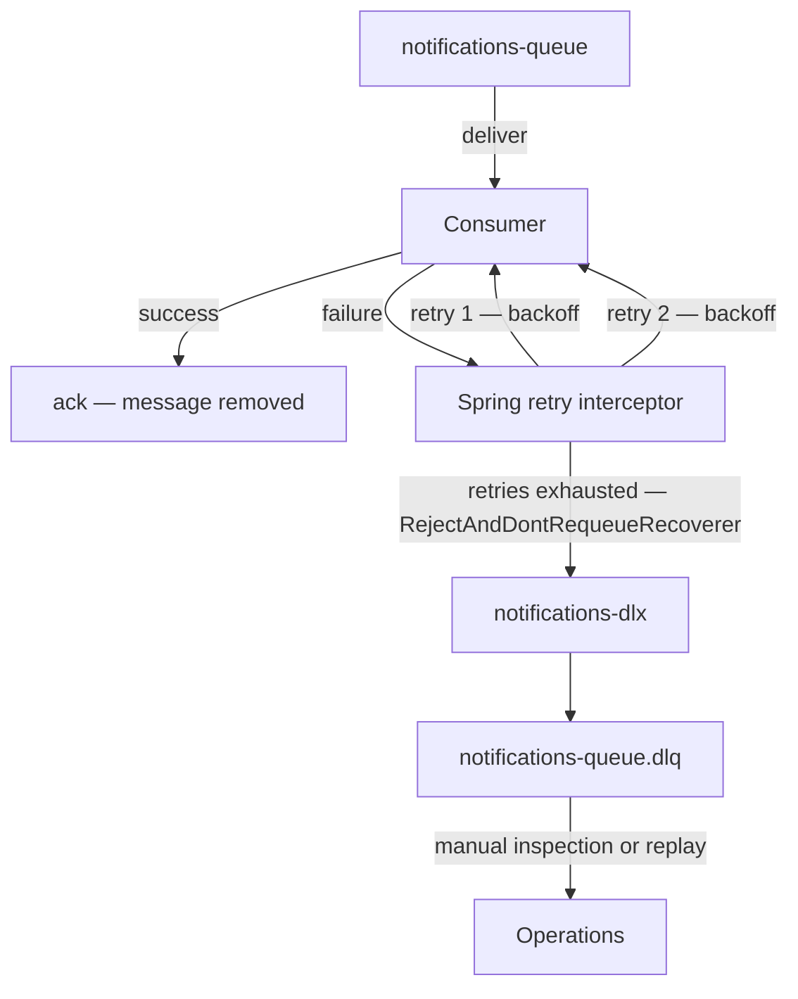

# Episode 12 — Asynchronous Messaging with RabbitMQ

## Opening – Synchronous calls are easy, until they are not

Throughout this series we have built the AcmeCorp platform service by service. The Gateway routes requests. The Orders service persists them. The Billing service charges for them. The Notification service tells the customer what happened. Each of those services talks to the others, and for most of the series, that communication has been synchronous. One service calls another, waits for a response, and continues.

Synchronous calls are easy to reason about. You make a request, you get a response, you know what happened. But synchronous calls have a property that becomes a problem at scale: they couple the caller to the callee. If the Notification service is slow, the Orders service waits. If the Notification service is down, the Orders service fails. The failure of one service propagates directly to the other, because they are connected in time.

Asynchronous messaging breaks that coupling. Instead of calling the Notification service directly, the Orders service publishes an event to a message broker. The Notification service consumes that event when it is ready. The Orders service does not wait. It does not know or care whether the Notification service is running. It just puts the event on the queue and moves on.

That decoupling is the core value of messaging. But it comes with a trade-off. Synchronous calls fail loudly and immediately. Messaging relocates failure. Instead of a synchronous error the caller handles immediately, you get a failure that lands somewhere in the broker layer — a growing queue, a dead-letter entry, a silent retry loop — and surfaces only if you are watching for it. A message that cannot be delivered, a consumer that crashes mid-processing, a payload that cannot be deserialized — these do not surface as an HTTP error the caller sees right away. They surface as messages that pile up, or disappear, or get processed twice. Understanding those failure modes is what this episode is about.

---

## Where async replaces sync – Choosing the boundary

**[DIAGRAM: E12-D01-sync-vs-async-boundaries]**

```mermaid
flowchart TD
    subgraph Synchronous — caller waits
        GW[Gateway] -->|HTTP| ORD[Orders]
        ORD -->|HTTP| BILL[Billing]
    end

    subgraph Asynchronous — caller does not wait
        ORD2[Orders] -->|publishes event| MQ[(RabbitMQ)]
        MQ -->|delivers message| NOTIF[Notification]
        MQ -->|delivers message| ANAL[Analytics]
    end
```

Not every service interaction should be asynchronous. The choice depends on whether the caller needs the result of the operation before it can continue.

When a customer places an order, the Orders service needs to know whether the order was persisted successfully before it can return a response to the caller. That is a synchronous operation. The caller is waiting. The result matters immediately.

But sending a confirmation email does not need to happen before the HTTP response goes back to the customer. The customer does not need to wait for the email to be sent. The email just needs to happen eventually, reliably, and without the Orders service having to manage it. That is the right boundary for an asynchronous event.

[SHOW: docker-compose.yml – RabbitMQ service definition and management port]

The same logic applies to analytics. Recording that an order was placed is important, but it does not need to block the order creation path. The Analytics service can consume the event in its own time, at its own pace, without affecting the latency of the Orders service at all.

The practical rule is: if the caller needs the result to continue, use synchronous communication. If the caller just needs to notify that something happened, use an event. The boundary is not about performance. It is about whether the result is needed now or just eventually.

---

## The event flow – Orders to Notifications

**[DIAGRAM: E12-D02-event-flow-orders-to-notifications]**



Let me walk through the message flow for the order-created event. When the Orders service successfully persists an order, it publishes an `OrderCreatedEvent` to a RabbitMQ exchange. The exchange is not a queue. It is a routing mechanism. It receives the message and decides which queues to deliver it to, based on the binding configuration.

[SHOW: OrderEventPublisher – rabbitTemplate.convertAndSend with exchange and routing key]

The Notification service has a queue bound to that exchange. When the message arrives in the queue, RabbitMQ holds it until the Notification service is ready to consume it. The consumer picks up the message and processes it. In this implementation, acknowledgement is managed by the Spring AMQP listener container rather than by the listener method directly. If processing succeeds, the container acknowledges the message and RabbitMQ removes it from the queue. If processing throws, the container's retry interceptor takes over.

[SHOW: NotificationConsumer – @RabbitListener method, Spring listener container retry config]

This is the at-least-once delivery model. But at-least-once is not an unconditional broker guarantee. It is a property of the full configuration stack. The queue must be durable. The message must be marked as persistent. The listener container must be configured to acknowledge only after successful processing. And publisher confirms must be enabled on the producer side. Any one of those conditions missing and the guarantee weakens or disappears entirely.

If the container processes the message but the application crashes before the ack is sent, RabbitMQ will redeliver the message to the next available consumer. That redelivery is correct behavior from the broker's perspective. The message was not acknowledged, so it must be retried.

The implication for the consumer is that it must be idempotent. Processing the same message twice must produce the same result as processing it once. For a notification service, that might mean checking whether a notification for a given order ID has already been sent before sending another one. The idempotency check is not optional. It is the contract that makes at-least-once delivery safe.

---

## Retries and dead-letter queues – What happens when processing fails

**[DIAGRAM: E12-D03-retry-and-dlq-flow]**



Not every message can be processed successfully on the first attempt. The downstream email provider might be temporarily unavailable. The message payload might reference an order that has not yet been replicated to the read model. A transient database connection error might interrupt the processing. These are recoverable failures, and the right response is to retry.

There are two broad approaches to retry in a Spring AMQP application. The first is broker-side: nack the message, let the broker redeliver it, and rely on dead-letter configuration to cap the attempts. The second is container-side: catch the exception inside the listener container, apply backoff and retry logic there, and only involve the broker once retries are exhausted. This implementation uses the container-side approach. The Spring AMQP listener container is configured with a stateless retry interceptor that retries the listener method directly, with backoff between attempts. The broker does not see individual retry attempts. It only sees the final outcome: either a successful ack, or a rejection without requeue that routes the message to the dead-letter exchange.

[SHOW: RetryInterceptor config – max attempts, backoff policy, RejectAndDontRequeueRecoverer]

The broker-side approach has a well-known failure mode: naive requeue creates a poison message loop. If the message is immediately requeued and immediately redelivered, a consumer that is failing fast will spin in a tight loop, consuming CPU and starving other messages in the queue. This is one of the most common ways a messaging system degrades in production. The container-side approach avoids this entirely. Retries happen inside the container process, with controlled backoff, and the broker is only involved at the end. The `RejectAndDontRequeueRecoverer` ensures that once retries are exhausted, the message is rejected without requeue and routed to the dead-letter exchange rather than cycling back into the main queue.

[SHOW: RabbitMQ topology config – notifications-exchange, notifications-queue, notifications-dlx, notifications-queue.dlq bindings]

When a message has been retried the maximum number of times and still cannot be processed, it should not be silently dropped. It should be moved to a dead-letter queue. The dead-letter queue is a holding area for messages that the system could not handle. It preserves the message so that it can be inspected, diagnosed, and replayed once the underlying problem is fixed.

The dead-letter queue is not a failure. It is a safety net. A system without a dead-letter queue loses messages silently. A system with a dead-letter queue loses nothing. The message is there, waiting, until someone decides what to do with it.

---

## Delivery guarantees – What the broker promises and what it does not

Let me be precise about what RabbitMQ actually guarantees, because the gap between what people assume and what the broker provides is where most messaging bugs live.

RabbitMQ guarantees that a message published to a durable queue will survive a broker restart, provided the message is marked as persistent and the queue is declared as durable. There is still a short window between the broker accepting the message and flushing it to disk where a hard crash can cause loss. Publisher confirms close that window: the broker only confirms a message after it has been persisted, giving the producer a reliable signal that the message is safe. Without publisher confirms, the producer has no way to know whether a message survived a broker crash between accept and flush.

[SHOW: queue declaration – durable: true, message properties – deliveryMode: PERSISTENT]

RabbitMQ provides at-least-once delivery when the listener container is configured to acknowledge only after successful processing. If the container uses automatic acknowledgement at the point of delivery rather than at the point of successful completion, a consumer crash after delivery but before processing loses the message permanently. The distinction is in the container's acknowledgement mode, not in whether the listener method calls ack explicitly.

Messages in a single queue are delivered in FIFO order under normal conditions. That ordering breaks down in at least three common situations: when a nacked message is requeued ahead of newer messages, when multiple consumers process from the same queue concurrently, or when a message is routed through a dead-letter exchange and re-enters a different queue position. RabbitMQ offers no per-consumer ordering guarantee across any of these cases. If your consumer logic depends on processing messages in a specific order, you need to design for that explicitly, not rely on the broker to enforce it.

What RabbitMQ also does not guarantee is exactly-once delivery. That is intentionally deferred in this episode. Exactly-once semantics require coordination between the publisher, the broker, and the consumer that goes beyond what a standard RabbitMQ setup provides. The practical approach for most workloads is at-least-once delivery combined with idempotent consumers, which achieves the same observable outcome without the complexity.

---

## Idempotency – The consumer's responsibility

Idempotency is not a RabbitMQ feature. It is a design responsibility that belongs to the consumer.

An idempotent consumer produces the same result whether it processes a message once or ten times. For the Notification service, that means tracking which order IDs have already triggered a notification. Before sending an email, the consumer checks whether a notification for that order ID already exists. If it does, it acknowledges the message and moves on. If it does not, it sends the email and records that it did.

[SHOW: NotificationService – idempotency check before send, deduplication record insert]

The idempotency record needs to be stored somewhere durable. Storing it in memory is not sufficient, because a consumer restart would lose the record and allow duplicate notifications. Storing it in the database alongside the notification record is the right approach. The check and the insert should happen in the same transaction so that a crash between them does not leave the system in an inconsistent state. Note that this pattern makes duplicates harmless, not impossible. The message will still be delivered more than once. The idempotency record is what ensures the second delivery produces no additional side effect.

This pattern, check then act then record, is the foundation of safe message consumption when the side effect is local. When the side effect is external — calling a payment provider, triggering a third-party email API — the pattern becomes harder, because the external call may succeed while the record insert fails, or vice versa. In those cases, the idempotency key needs to be scoped to the external system as well, not just to the local database. It applies to any consumer that has side effects: sending emails, charging payment methods, updating external systems. The side effect should happen at most once per message, and the idempotency record is what enforces that.

---

## Observability – What to watch in the running system

A messaging system that you cannot observe is a messaging system you cannot operate. Let me show you what to watch.

[SHOW: RabbitMQ management UI – queue depth, message rates, consumer count]

Queue depth is a lagging indicator. A queue that is growing tells you consumers are not keeping up, but it does not tell you why, and by the time it is visibly growing, the problem has usually been present for a while. The more actionable signal is message rate: the difference between the publish rate and the consume rate. A stable queue depth with high publish and consume rates is healthy. A stable queue depth with zero consume rate means consumers have stopped, even if depth has not yet moved.

The second signal is the dead-letter queue depth. A dead-letter queue that is growing means messages are failing their maximum retry attempts. That is a signal that something is systematically wrong, either with the message format, the consumer logic, or a downstream dependency that the consumer relies on. Dead-letter queue growth should trigger an alert, not just a dashboard observation.

[SHOW: Grafana – RabbitMQ queue depth panel and DLQ depth panel]

The third signal is consumer count. A queue with zero consumers is not delivering any messages. This is easy to miss if you are only watching queue depth, because the depth will grow silently without any error. Monitoring consumer count alongside queue depth gives you the full picture.

The fourth signal is message age. How long has the oldest unacknowledged message been sitting in the queue? A message that has been waiting for minutes when the normal processing time is milliseconds is a signal that something is stuck. RabbitMQ exposes this through the management API and through the Prometheus plugin if it is enabled.

---

## Walking through the local stack

Let me show you the message flow running in the local Docker Compose stack. This is the same stack we have been using throughout the series, with RabbitMQ running as a managed container alongside the application services.

[SHOW: docker-compose.yml – RabbitMQ container with management plugin enabled]

We start with the normal path. A POST to `/api/notification/send` with a valid payload returns immediately with a status of `QUEUED`. The message flows through `notifications-exchange` to `notifications-queue`, the listener container picks it up, processes it, and the container acknowledges it. The queue depth returns to zero. A GET on the notification confirms the status is `SENT`.

[SHOW: RabbitMQ management UI – notifications-queue depth at zero after successful processing]

Now the failure path. We send a request with a recipient address that is configured to trigger a deterministic failure. The listener container receives the message and the listener method throws. The retry interceptor catches the exception and retries with backoff. In the logs you can see attempt one, attempt two, attempt three, and then retries exhausted. At that point the `RejectAndDontRequeueRecoverer` rejects the message without requeue. RabbitMQ routes it to `notifications-dlx`, which delivers it to `notifications-queue.dlq`. The final state is exactly what we expect: `notifications-queue` at zero, `notifications-queue.dlq` at one.

[SHOW: service logs – attempt 1, attempt 2, attempt 3, retries exhausted]

[SHOW: RabbitMQ management UI – notifications-queue.dlq depth at one]

That message is not lost. It is sitting in `notifications-queue.dlq` with its original headers intact, including the original routing key, the source exchange, and the `x-death` header that RabbitMQ appends to record the dead-lettering reason and count. When the underlying problem is fixed, we can replay the message from the dead-letter queue and the Notification service processes it successfully.

---

## What is intentionally deferred

This episode has not covered exactly-once semantics. Achieving exactly-once delivery with RabbitMQ requires outbox patterns, distributed transactions, or idempotency keys coordinated across the publisher and consumer in ways that go significantly beyond the setup shown here. For most workloads, at-least-once delivery with idempotent consumers is the right trade-off. Exactly-once is a separate topic with its own complexity budget.

Kafka comparisons are also out of scope. RabbitMQ and Kafka solve related but different problems. RabbitMQ is a message broker optimized for flexible routing, acknowledgement-based delivery, and operational simplicity. Kafka is a distributed log optimized for high-throughput event streaming and long-term retention. Choosing between them depends on your workload, your team's operational experience, and what you need the messaging layer to do. That comparison deserves its own episode.

---

## Closing – Decoupling is not free

Asynchronous messaging gives you decoupling. The Orders service no longer waits for the Notification service. The Notification service can be slow, or down, or redeployed, without affecting the order creation path. That is a real and valuable property.

But decoupling is not free. It relocates failure rather than removing it. The failure that used to surface as an HTTP 500 the caller handled immediately now surfaces as a dead-letter entry, a stalled consumer, or a queue that stopped making progress. The failure is the same. The observability requirement is different.

The mental models that matter are delivery guarantees, idempotency, and the dead-letter queue. Delivery guarantees tell you what the broker promises and what it does not — and that those promises are conditional on how you configure the full stack. Idempotency tells you what the consumer must guarantee regardless of how many times a message is delivered, and that it makes duplicates harmless rather than impossible. The dead-letter queue tells you that no message should ever be silently lost, and that every failure deserves a place to land where it can be inspected and replayed.

Get those three things right, and asynchronous messaging becomes a tool that makes your system more resilient. Get them wrong, and it becomes a place where failures go to hide.

Decouple deliberately. Observe everything.
