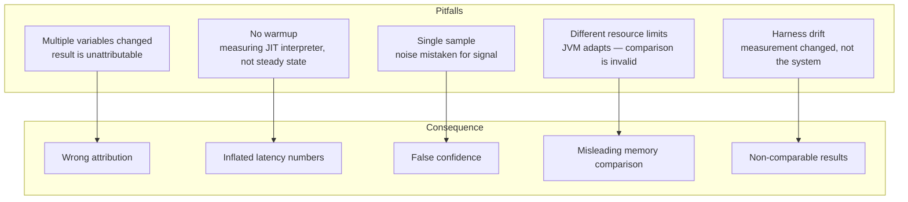

```mermaid
flowchart TD
    subgraph Pitfalls
        P1[Multiple variables changed<br>result is unattributable]
        P2[No warmup<br>measuring JIT interpreter, not steady state]
        P3[Single sample<br>noise mistaken for signal]
        P4[Different resource limits<br>JVM adapts — comparison is invalid]
        P5[Harness drift<br>measurement changed, not the system]
    end

    subgraph Consequence
        C1[Wrong attribution]
        C2[Inflated latency numbers]
        C3[False confidence]
        C4[Misleading memory comparison]
        C5[Non-comparable results]
    end

    P1 --> C1
    P2 --> C2
    P3 --> C3
    P4 --> C4
    P5 --> C5
```