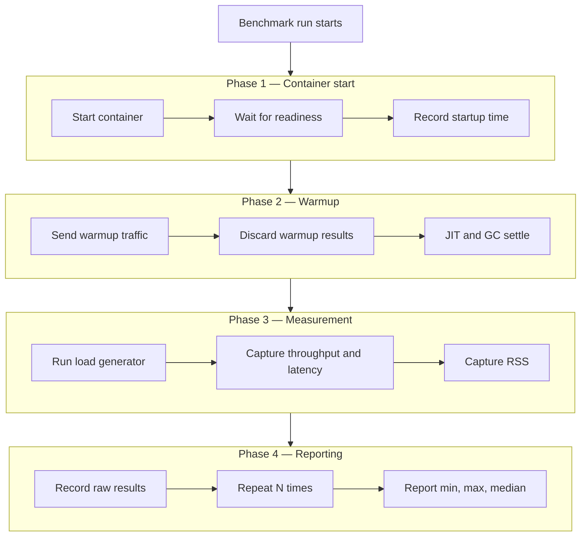

```mermaid
flowchart TD
    A[Benchmark run starts]

    subgraph P1 ["Phase 1 — Container start"]
        S1[Start container]
        S2[Wait for readiness]
        S3[Record startup time]
        S1 --> S2 --> S3
    end

    subgraph P2 ["Phase 2 — Warmup"]
        W1[Send warmup traffic]
        W2[Discard warmup results]
        W3[JIT and GC settle]
        W1 --> W2 --> W3
    end

    subgraph P3 ["Phase 3 — Measurement"]
        M1[Run load generator]
        M2[Capture throughput and latency]
        M3[Capture RSS]
        M1 --> M2 --> M3
    end

    subgraph P4 ["Phase 4 — Reporting"]
        R1[Record raw results]
        R2[Repeat N times]
        R3[Report min, max, median]
        R1 --> R2 --> R3
    end

    A --> P1 --> P2 --> P3 --> P4
```