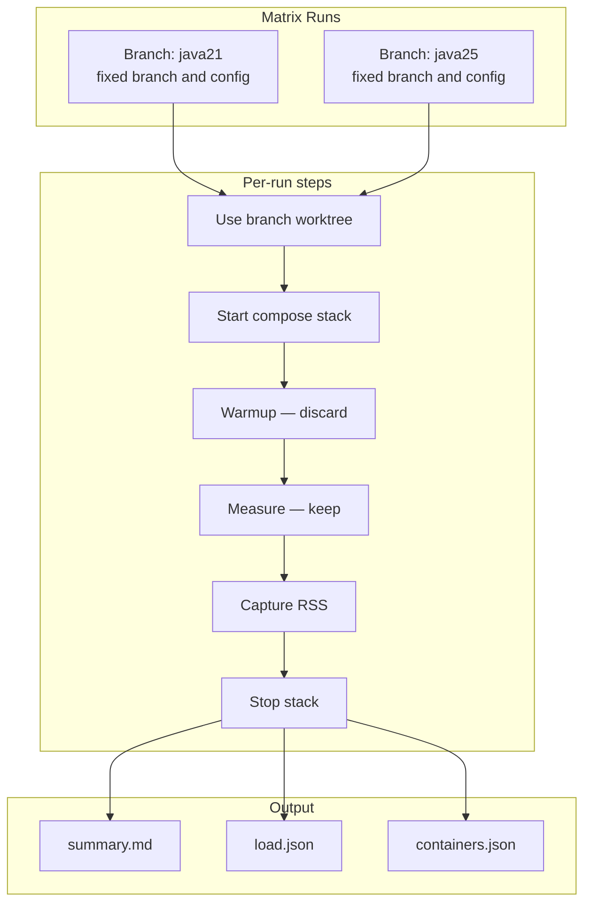

```mermaid
flowchart TD
    subgraph Matrix Runs
        B1[Branch: java21\nfixed branch and config]
        B2[Branch: java25\nfixed branch and config]
    end

    subgraph Per-run steps
        R1[Use branch worktree]
        R2[Start compose stack]
        R3[Warmup — discard]
        R4[Measure — keep]
        R5[Capture RSS]
        R6[Stop stack]
    end

    subgraph Output
        O1[summary.md]
        O2[load.json]
        O3[containers.json]
    end

    B1 --> R1 --> R2 --> R3 --> R4 --> R5 --> R6 --> O1 & O2 & O3
    B2 --> R1
```
