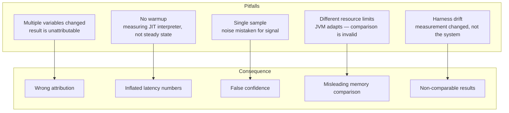
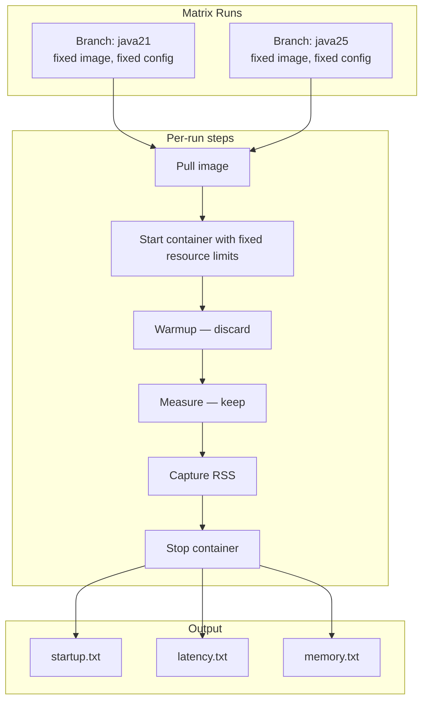

# Episode 13 — Benchmarking & Performance Methodology

## Opening – Benchmarks often lie

In the previous two episodes we looked at JVM performance signals and then applied them to a real upgrade decision. We read benchmark output, compared numbers across versions, and drew conclusions. But there was a thread running through both of those episodes that deserves its own treatment: the question of whether the benchmark itself was trustworthy.

A benchmark that changes multiple variables at once does not measure performance. It measures the combined effect of everything that changed, and it cannot tell you which change caused which outcome. A benchmark run without warmup measures startup behavior and calls it steady-state performance. A benchmark with a single sample per version mistakes noise for signal. A benchmark that cannot be reproduced by someone else on a different day is not evidence. It is an anecdote.

Most benchmark problems are not caused by bad intentions. They are caused by skipping steps that feel unnecessary until you get a result you cannot explain. This episode is about building a benchmarking practice that produces results you can actually trust — not because the numbers are always good, but because you understand exactly what they mean and what they do not.

The methodology is not complicated. Fix the variables you are not measuring. Warm up before you measure. Take multiple samples. Report honestly. Reproduce before you conclude. Each of those steps has a reason, and understanding the reason is what makes the practice stick.

---

## Common pitfalls – Why benchmarks mislead

**[DIAGRAM: E13-D01-benchmark-pitfalls]**



Let me name the pitfalls explicitly, because they are easy to fall into and hard to notice once you are inside them.

The first pitfall is changing multiple variables at once. This is the most common one, and we saw it directly in Episode 10. When you compare two branches of a platform where the JVM version, the framework version, the packaging format, and the persistence path all changed simultaneously, the benchmark output reflects all of those changes combined. You cannot attribute the result to any single variable. The number is real. The interpretation is not.

[SHOW: bench/run-matrix.sh – branch matrix entries showing what varies between runs]

The second pitfall is measuring without warmup. The JVM starts in interpreted mode. The JIT compiler needs time to identify hot paths and compile them. If you start the service and immediately begin measuring, you are capturing the interpreter phase, not the steady-state performance. The numbers will be worse than production behavior, and they will be inconsistent across runs because the JIT compilation timing varies.

The third pitfall is a single sample. JVM behavior has variance. GC timing, JIT compilation decisions, OS scheduling, and network jitter all introduce run-to-run variation. A single measurement cannot tell you whether a result is representative or an outlier. You need enough samples to see the distribution, not just a point.

The fourth pitfall is different resource limits between runs. The JVM adapts its heap sizing and GC behavior to the available memory and CPU. Thread pool sizing is typically controlled by the framework or application, but it too responds to the resource environment — either through explicit configuration or through defaults that scale with available processors. A service benchmarked with 512 megabytes of memory will behave differently from the same service benchmarked with 2 gigabytes. If the resource limits differ between the two versions you are comparing, the comparison is invalid regardless of how carefully you controlled everything else.

The fifth pitfall is harness drift. If the benchmark script itself changes between runs — different readiness gating, different load duration, different load generator version — the results are not comparable even if the application is identical. The harness is part of the measurement. Changes to it change the output.

---

## The measurement lifecycle – Warmup, measure, report

**[DIAGRAM: E13-D02-measurement-lifecycle]**

```mermaid
flowchart LR
    subgraph Phase 1 — Container start
        S1[Start container]
        S2[Wait for readiness condition]
        S3[Record time-to-ready\nstartup measurement complete]
    end

    subgraph Phase 2 — Warmup
        W1[Send warmup traffic\ndiscard results]
        W2[Wait for JIT stabilisation\nGC pattern settles]
    end

    subgraph Phase 3 — Measurement window
        M1[Run load generator\nfixed duration, fixed concurrency]
        M2[Capture throughput and latency]
        M3[Capture RSS from docker stats]
    end

    subgraph Phase 4 — Reporting
        R1[Record raw results]
        R2[Repeat N times]
        R3[Report min, max, median\nnot just average]
    end

    S1 --> S2 --> S3 --> W1 --> W2 --> M1 --> M2 --> M3 --> R1 --> R2 --> R3
```

The measurement lifecycle has four phases, and each one has a specific purpose. Skipping any of them degrades the quality of the result in a predictable way.

The first phase is container start. The service starts cold, and we measure the time from container launch to the first response that satisfies the defined readiness condition — typically a health check endpoint, but what that endpoint actually validates varies by service. This is the startup measurement. It is captured once per run, before any warmup traffic is sent. It is an offline measurement — it does not come from Prometheus or Grafana, because by the time the service is scraping metrics, the startup phase is already over.

[SHOW: benchmark script – health check polling loop, time-to-ready capture]

The second phase is warmup. After the service is ready, we send a period of traffic that we deliberately discard. The purpose is to give the JIT compiler time to identify and compile the hot paths, and to let the GC pattern stabilise. How long warmup needs to be depends on the service and the framework. A Spring Boot service with a complex dependency graph may need longer than a lightweight Quarkus service. The signal that warmup is complete is stable latency and a stable GC pattern — not a fixed time interval. The heap will continue to fluctuate through normal collection cycles. What you are looking for is that the allocation rate and pause frequency have settled into a consistent rhythm.

The third phase is the measurement window. This is the only traffic whose results we keep. The load generator runs for a fixed duration at a fixed concurrency level. We capture throughput in requests per second, latency at the percentiles we care about, and RSS from docker stats at the end of the window. The measurement window must be long enough that transient GC events do not dominate the latency numbers, but short enough that the run is practical to repeat.

[SHOW: benchmark script – warmup block discarded, measurement window timed separately]

The fourth phase is reporting. We record the raw results, repeat the full cycle a fixed number of times, and report the distribution across runs rather than a single number. The minimum, maximum, and median across runs tell you more than the average. An average that hides a single outlier run is not a useful summary. If one run out of five shows a p95 spike that the others do not, that spike is information, not noise to be averaged away.

---

## The branch matrix – Reproducibility as a first-class concern

**[DIAGRAM: E13-D03-reproducible-branch-matrix]**



Reproducibility is not a nice-to-have. It is the property that makes a benchmark result mean something beyond the moment it was collected. If you cannot reproduce a result, you cannot validate it, share it, or build on it.

The branch matrix approach in this repository makes reproducibility explicit. Each entry in the matrix names a branch, a fixed container image, and a fixed set of resource limits. The benchmark script pulls the image, starts the container with those limits, runs the full measurement lifecycle, and writes the results to a named output directory. Running the matrix again on a different day should produce results within the expected variance of the first run. If it does not, something changed — and the matrix structure makes it easier to identify what.

[SHOW: bench/run-matrix.sh – matrix entries, resource limit flags, output directory structure]

The resource limits deserve particular attention. The JVM's heap sizing heuristics, GC thread count, and default parallelism all respond to the available CPU and memory. If you run the benchmark without explicit limits, the JVM will use whatever the host machine provides, and that will differ between developer laptops, CI runners, and production nodes. Fixing the limits in the matrix script means the JVM sees the same environment every time, and the results are comparable across machines.

[SHOW: docker run flags – --memory, --cpus set explicitly in benchmark script]

The output directory structure matters too. Each run writes its results to a path that encodes the branch name, the run number, and a timestamp. That structure means you can compare runs across time, not just across branches. If the results for the java21 branch drift between runs taken a week apart, something in the environment changed. The output history is the evidence.

---

## Startup vs steady-state – Two measurements, not one

Let me be concrete about how startup and steady-state measurements are separated in practice, because conflating them is one of the most common sources of misleading benchmark results.

Startup time is measured once, immediately after the container satisfies the readiness condition. It captures the full initialization path: JVM startup, class loading, framework bootstrap, dependency injection wiring, and database connection pool initialization. It is a cold measurement. It does not reflect what the service does under sustained load.

[SHOW: benchmark output – startup.txt with time-to-ready per branch per run]

Steady-state performance is measured after warmup, during the measurement window. It captures throughput and latency after the JIT has compiled the hot paths and the GC pattern has stabilised. It reflects what the service does when it has been running for a while under representative load. It is the number that matters for production capacity planning.

These two measurements answer different questions. Startup time matters for deployment speed, rolling update duration, and crash recovery time. Steady-state performance matters for request handling capacity and latency under load. Optimizing one does not improve the other. Comparing them as if they were the same thing produces conclusions that are wrong in both directions.

A service that starts in two seconds and handles ten thousand requests per second at five milliseconds p95 is a different profile from a service that starts in eight seconds and handles twelve thousand requests per second at three milliseconds p95. Which profile is better depends entirely on what you are optimizing for. The benchmark should report both numbers separately and let the reader apply the appropriate weight.

---

## Memory snapshots – What multi-sample RSS tells you

Memory measurement has its own methodology requirements, and they are different from latency measurement.

RSS is not a stable number. It changes as the heap grows and shrinks through GC cycles, as the JIT code cache fills, and as the OS reclaims pages that have not been accessed recently. A single RSS snapshot taken at an arbitrary moment during the measurement window is not representative. It could be taken at a heap peak, a heap trough, or anywhere in between.

[SHOW: benchmark script – RSS capture loop, multiple snapshots during measurement window]

The right approach is to take multiple RSS snapshots at fixed intervals during the measurement window and report the distribution. The median RSS across snapshots is a more stable estimate of the service's memory footprint than any single reading. The maximum RSS tells you the worst-case footprint, which is what matters for container memory limit sizing. The minimum RSS is the noisiest of the three. RSS is influenced by OS page reclamation timing, which is outside the JVM's control. Treat it as a lower-bound signal rather than a precise measure of anything specific.

When you compare RSS across branches, you are comparing distributions, not points. A branch that shows a lower median RSS but a higher maximum RSS than another branch is not straightforwardly better or worse. It depends on whether you are optimizing for average footprint or worst-case footprint. The benchmark should report both, and the interpretation should be explicit about which dimension matters for the decision at hand.

[SHOW: benchmark output – memory.txt with min, median, max RSS per branch]

One more thing about RSS comparisons across JVM versions or framework versions: the RSS reflects the full process footprint, including native memory that the JVM does not report through its own metrics. Heap usage visible in Grafana is a subset of RSS. If RSS changes between two benchmark runs and the heap metrics look similar, the difference is in native memory — metaspace, JIT code cache, thread stacks, or direct buffers. That distinction matters for diagnosing the cause of a memory difference, even if it does not change the container sizing decision.

---

## Interpreting results honestly – What the numbers allow you to conclude

Running a benchmark correctly is necessary but not sufficient. The interpretation has to match the scope of what was measured.

A benchmark that compares two branches where only the JVM version changed can attribute performance differences to the JVM with reasonable confidence, provided the resource limits were fixed, warmup was applied, and multiple samples were taken. That is a controlled comparison.

A benchmark that compares two branches where the JVM, the framework, the packaging, and the application logic all changed cannot attribute the result to any single variable. The result is still useful — it tells you the net effect of all the changes combined — but it cannot support a claim like "Java 25 is faster." It can only support a claim like "the java25 branch performs differently from the java21 branch, and here are the contributing factors we know about."

[SHOW: benchmark output side by side – java21 vs java25 results with known variable differences noted]

This distinction is not pedantic. It matters when you are making a decision based on the results. If you attribute the difference to the JVM when it was actually caused by a heavier persistence path, you will make the wrong infrastructure decision. You will upgrade the JVM expecting a performance improvement that will not materialise, because the improvement you saw was in the application logic, not the runtime.

The honest interpretation practice is to list the variables that changed alongside the results. Not as a disclaimer, but as part of the result. The benchmark output is not just the numbers. It is the numbers plus the context that makes them interpretable.

---

## What is intentionally deferred

This episode has not covered microbenchmarking with JMH. JMH, the Java Microbenchmark Harness, is the right tool for measuring the performance of individual methods, data structures, or algorithms in isolation. It handles warmup, dead code elimination, and statistical reporting in ways that a system-level benchmark harness does not. If you need to measure the cost of a specific code path rather than the behavior of a running service, JMH is the appropriate tool. That is a separate topic with its own methodology requirements.

Statistical significance is also deferred. Determining whether a performance difference between two benchmark runs is statistically significant requires understanding the variance of the measurements, the sample size, and the appropriate test for the distribution. That level of rigor is valuable for published research and for decisions with high stakes and low reversibility. For most engineering decisions, the practical approach is to look at the spread across runs, check whether the distributions overlap, and apply judgment. The key distinction is between making an engineering decision and making a scientific claim. You do not need statistical significance to decide whether to proceed with an upgrade. You need it if you are asserting that a difference is real and not noise.

---

## Closing – Methodology is what makes results trustworthy

We have covered a lot of ground in this episode. Pitfalls, lifecycle phases, branch matrices, resource limits, warmup, multi-sample reporting, and honest interpretation. That might feel like a lot of process for something that should just be running a script and reading a number.

But the process is not overhead. It is what separates a number you can act on from a number that misleads you. Every step in the methodology exists because something went wrong without it. Warmup exists because people measured interpreter performance and called it production performance. Multiple samples exist because people trusted a single run that happened to be an outlier. Fixed resource limits exist because people compared results from machines with different memory and drew conclusions about the JVM. The methodology is the accumulated lesson of those mistakes.

The benchmark harness in this repository is not perfect. It compares branches, not isolated variables. It does not enforce statistical significance. It does not prevent configuration drift between matrix entries. Those are real limitations, and they are worth knowing. But it does enforce warmup separation, it does capture startup and steady-state as distinct measurements, and it does write results to a reproducible output structure. That is a meaningful baseline.

[SHOW: bench/ directory structure – run-matrix.sh, output directories, result files]

The goal is not a perfect benchmark. The goal is a benchmark that is honest about what it measures, consistent in how it measures it, and clear about what the results allow you to conclude. A benchmark that meets those three criteria is useful even when the results are inconclusive. An inconclusive result that you understand is more valuable than a confident result that is wrong.

Measure carefully. Interpret honestly. Reproduce before you conclude.
