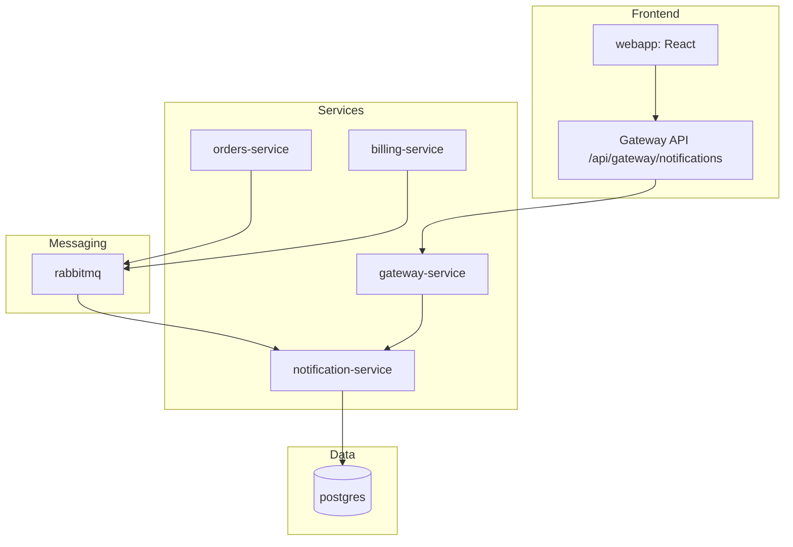

# Notification System Integration

The AcmeCorp Platform includes a complete notification system with RabbitMQ messaging and React UI integration.

## Architecture



**Source:** [`docs/diagrams/notification-system.mmd`](./diagrams/notification-system.mmd)

<details>
<summary>Rendered diagram (SVG)</summary>


</details>

<details>
<summary>Original ASCII diagram (historical)</summary>

```
Orders Service → RabbitMQ → Notification Service → Database
Billing Service → RabbitMQ → Notification Service → Database
                                     ↓
Gateway Service ← REST API ← React Frontend
```
</details>

## Components

### Backend Services

**Orders Service** (`NotificationPublisher`)
- Publishes order confirmation messages to RabbitMQ
- Triggered automatically on order confirmation (not creation)
- Exchange: `notifications-exchange`, Routing Key: `notifications.key`

**Billing Service** (`NotificationPublisher`)
- Publishes invoice payment messages to RabbitMQ
- Triggered automatically on invoice payment
- Exchange: `notifications-exchange`, Routing Key: `notifications.key`

**Notification Service** (`NotificationListener`)
- Consumes messages from `notifications-queue`
- Stores notifications in PostgreSQL database
- Exposes REST API at `/api/notification`

**Gateway Service**
- Routes notification API calls via `/api/gateway/notifications`
- Provides unified API access for frontend

### Frontend Integration

**React Components**
- `webapp/src/views/Notifications.tsx` - Main notification list view
- `webapp/src/components/Invoices.tsx` - Invoice management and payment interface
- Navigation integration in sidebar menu
- Real-time data fetching via API client

**API Integration**
- `listNotifications()` - Fetch paginated notifications
- `getNotification(id)` - Get individual notification details
- `listInvoices()` - Fetch paginated invoices
- `payInvoice(id, payment)` - Pay invoice and trigger notification
- Automatic error handling and loading states

## Message Format

```json
{
  "recipient": "customer@example.com",
  "message": "Your order ORD-2025-00001 has been confirmed.",
  "type": "ORDER_CONFIRMATION",
  "orderNumber": "ORD-2025-00001",
  "timestamp": "2025-12-17T21:30:00Z"
}
```

## Notification Types

- `ORDER_CONFIRMATION` - Sent when orders are confirmed
- `INVOICE_PAID` - Sent when invoices are paid
- `GENERIC` - General purpose notifications

## UI Features

### Notification List
- Paginated table display
- Status badges (SENT, PENDING, FAILED)
- Type badges (ORDER_CONFIRMATION, etc.)
- Recipient and message display
- Timestamp formatting

### Navigation
- Accessible via "Notifications" in sidebar
- Real-time data updates
- Error handling with user feedback

## Testing

### Create Test Notification
```bash
# Create order
curl -X POST http://localhost:8080/api/gateway/orders \
  -H "Content-Type: application/json" \
  -d '{"customerId": 1, "customerEmail": "test@example.com", "items": [{"productId": 1, "quantity": 2}]}'

# Confirm order to trigger notification (replace {id} with actual order ID)
curl -X POST http://localhost:8080/api/gateway/orders/{id}/confirm

# Pay invoice to trigger payment notification (replace {invoice_id} with actual invoice ID)
curl -X POST http://localhost:8080/api/gateway/billing/invoices/{invoice_id}/pay \
  -H "Content-Type: application/json" \
  -d '{"paymentMethod": "DEMO"}'

# View notifications via API
curl http://localhost:8080/api/gateway/notifications

# View in UI
# Navigate to http://localhost:5173/notifications
# Navigate to http://localhost:5173/invoices
```

### Direct Service Testing
```bash
# Test notification service directly
curl http://localhost:8083/api/notification

# Test billing service directly
curl http://localhost:8082/api/billing/invoices

# Check RabbitMQ management
# http://localhost:15672 (guest/guest)
```

## Configuration

### Environment Variables
- `RABBITMQ_HOST` - RabbitMQ server host
- `RABBITMQ_PORT` - RabbitMQ server port (default: 5672)
- `NOTIFICATION_BASE_URL` - Notification service URL for gateway
- `SPRING_AMQP_DESERIALIZATION_TRUST_ALL` - Allow RabbitMQ message deserialization (set to `true`)

### RabbitMQ Setup
- Exchange: `notifications-exchange` (Topic)
- Queue: `notifications-queue` (Durable)
- Routing Key: `notifications.key`

## Troubleshooting

### No Notifications Appearing
1. Check RabbitMQ connection in service logs
2. Verify order confirmation (not creation) triggers message publishing
3. Check notification service message consumption
4. Verify database storage
5. Ensure `SPRING_AMQP_DESERIALIZATION_TRUST_ALL=true` is set for notification service

### UI Not Loading
1. Check gateway service routing
2. Verify API endpoint `/api/gateway/notifications`
3. Check browser network tab for API errors
4. Verify React component error handling

### Message Processing Issues
```bash
# Check service logs
docker compose logs notification-service
docker compose logs orders-service

# Check RabbitMQ queues
docker exec acmecorp-rabbitmq rabbitmqctl list_queues
```

## Production Considerations

- Use Amazon MQ for managed RabbitMQ in AWS
- Implement message persistence and retry logic
- Add notification delivery status tracking
- Consider push notifications for real-time updates
- Implement notification preferences per user
