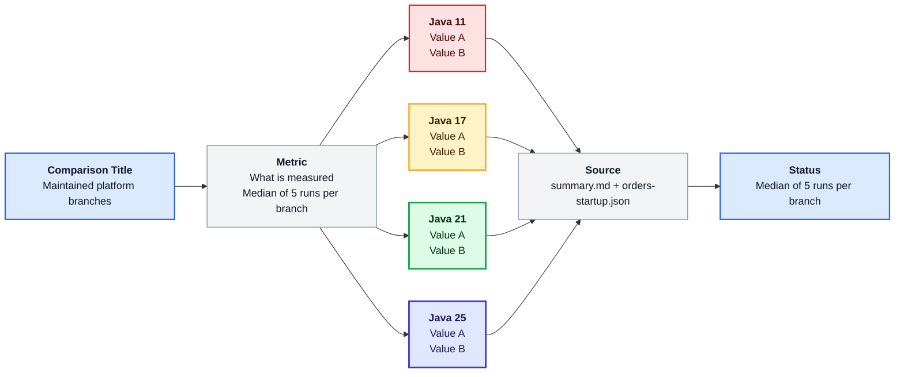
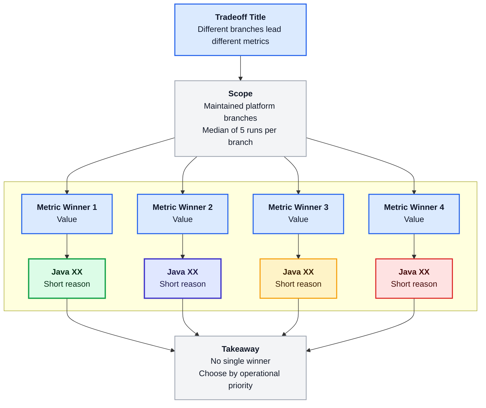
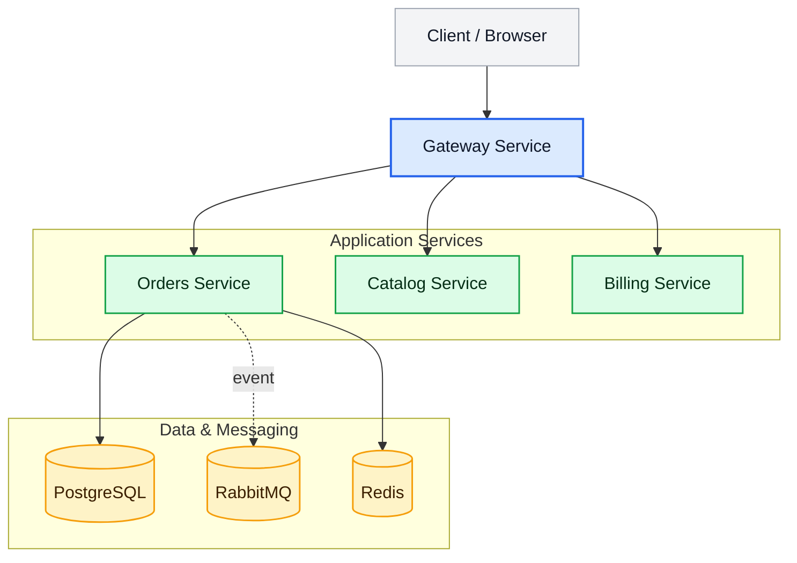
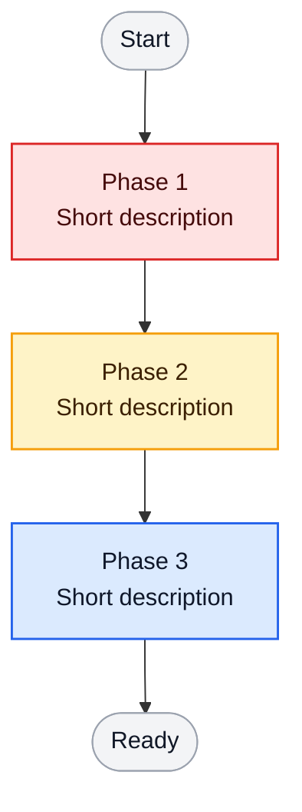

# Mermaid Templates

These templates are the default starting point for new AcmeCorp Mermaid diagrams.

Adjust labels and values, but keep the overall structure unless the teaching goal clearly requires a different layout.

## Benchmark comparison template

Use this for:
- startup comparisons
- memory comparisons
- throughput comparisons
- branch-by-branch measured results

```md

```

## Tradeoff summary template

Use this for:
- no-single-winner benchmark summaries
- platform tradeoff slides
- end-of-section comparison wrap-ups

```md

```

## Architecture overview template

Use this for:
- service maps
- deployment topology
- layered platform views

```md

```

## Startup/lifecycle template

Use this for:
- startup phases
- readiness/liveness distinctions
- build-time vs runtime lifecycle views

```md

```

